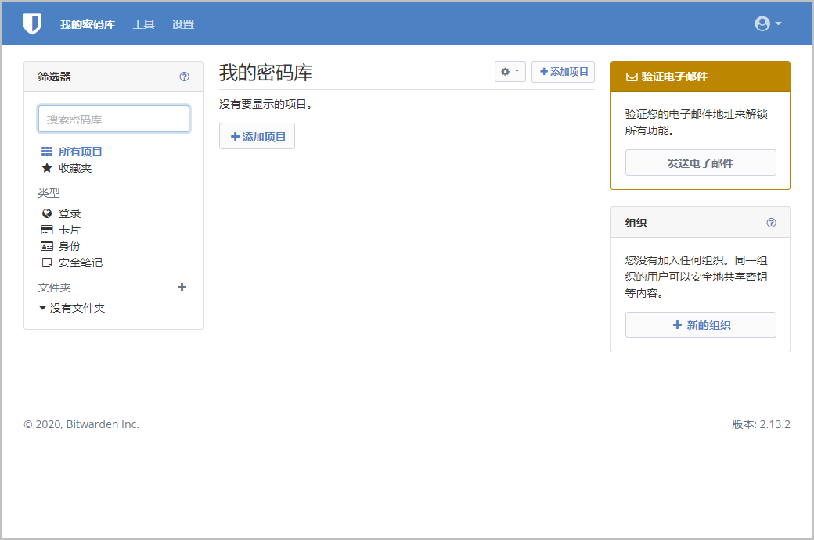
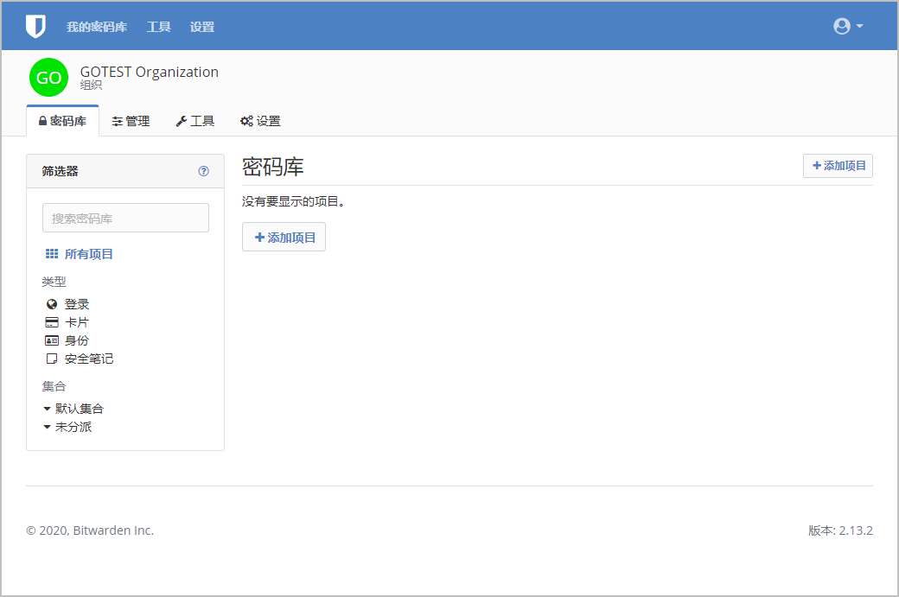

# 组织入门


对应的[官方文档地址](https://bitwarden.com/help/article/getting-started-organizations/)


像 Bitwarden 这样的密码管理器使您可以轻松地在您的所有设备上存储和访问唯一且安全的密码，从而使您的在线账户比以往任何时候都更加安全！使用 Bitwarden，你将不需要危险地重复使用简单的密码，也不必以电子表格、文档或便笺等未加密的格式暴露密码。

**Bitwarden 组织**为您的家庭、团队或企业的密码管理增加了一层协作和共享，使您可以安全地共享常见信息，例如办公室 wifi 密码、在线凭据或共享的公司信用卡。组织拥有的凭据的安全共享既**安全**又**简单**。

本文将帮助您开始使用**免费的 2 人组织**，这样您就可以立即体验安全的共享。

## 什么是组织？ 

Bitwarden 组织将用户和密码库项目关联在一起，以[安全地共享](../password-manager/vault-basics/sharing.md)组织拥有的登录、笔记、支付卡和身份。组织可以是一个家庭、团队、公司或需要安全共享数据的任何一群人。组织具有独立的密码库，[管理员](user-management/user-types-and-access-control.md)可以在其中管理组织的项目、用户和设置：


组织密码库


### 组织与高级会员比较 

关键的是要知道，**组织可以启用组织到用户之间的安全共享**。[高级个人计划](../my-account/plans-and-pricing/about-bitwarden-plans.md#premium-individual)可解锁高级密码安全和管理功能，包括高级 2FA 选项、Bitwarden 验证器（TOTP）、加密的文件附件等，但高级个人**不包含安全数据共享功能**。

付费组织（家庭、团队或企业）自动为组织中已注册的**每一个**用户提供这些高级功能（高级 2FA 选项、Bitwarden 验证器（TOTP）等）。

## 设置 Bitwarden 账户 

免费的 Bitwarden 组织允许 2 位用户安全地共享组织拥有的凭证。您可以使用免费的组织与朋友或伙伴共享，或者在[升级到不同的计划](../my-account/plans-and-pricing/about-bitwarden-plans.md)之前测试组织。

Bitwarden 在许多设备上提供了应用程序，包括浏览器扩展、移动应用程序、桌面应用程序和 CLI，但在本指南中，我们将重点介绍[网页密码库](../password-manager/getting-started/getting-started-webvault.md)。对于管理你的组织，**网页密码库提供了最丰富的 Bitwarden 体验**。

### 注册 Bitwarden 

[创建一个 Bitwarden 帐户](https://vault.bitwarden.com/#/register)，并确保您挑选了一个强大而难忘的[主密码](../my-account/log-in-and-unlock/your-master-password.md)。我们甚至建议您写下您的主密码，并将其存储在安全的地方。


**不要忘记您的主密码！**Bitwarden 是一种零知识的解决方案，这意味着 Bitwarden 团队以及 Bitwarden 系统本身对你的主密码一无所知，也没有办法找回或重置你的主密码。


创建帐户后，登录到[网页密码库](../password-manager/getting-started/getting-started-webvault.md)并验证帐户的电子邮件地址以解锁对所有功能的访问权限：

### 再次注册 Bitwarden 

为了使用免费的 2 人组织进行安全共享，您需要拥有 2 个 Bitwarden 帐户。设置了第一个 Bitwarden 帐户后，请按照相同的步骤（或帮助您的朋友或伴侣操作）来设置另一个帐户。


Bitwarden 组织具有深层次的[用户级别访问控制](user-management/user-types-and-access-control.md)。无论你用哪个用户来[设置你的组织](getting-started-organizations.md#setup-your-organization)，其都将成为**所有者**。


## 设置您的组织 

要设置您的组织：

1. 在您的网页密码库中，选择 ✚**新建组织**按钮。
2. 输入**组织名称**和**帐单电子邮件**，我们可以通过此地址与您联系。在本指南中，我们将设置一个免费的组织，所以你将不会被收取任何费用。
3. **选择您的计划**。Bitwarden 提供适合任何需求的组织，但在这种情况下，请选择**免费**。
4. 向下滚动并选择**提交**以完成组织的创建。

### 了解您的组织 

创建完成后，您将进入组织密码库，这是所有内容共享和组织管理的中心。作为[组织所有者](user-management/user-types-and-access-control.md)，您将能够查看您的**密码库**，管理用户和[集合](getting-started-organizations.md#get-to-know-collections)，使用一些 Bitwarden **工具**以及配置组织的**设置**：

### 了解集合 

集合是 Bitwarden 组织的重要组成部分；它们代表[属于您的组织](getting-started-organizations.md#shared-items)拥有的密码库项目的逻辑分组。您的组织预设了一个**默认集合**和一个**未分配**标签。对于免费组织，您可以使用**管理**选项卡创建最多 2 个集合：


集合



在很多方面，集合类似于用来组织个人密码库的[文件夹](../password-manager/vault-administration/folders.md)。一个关键的区别是，[属于您的组织](getting-started-organizations.md#shared-items)的项目**必须包括在至少一个集合中**。


## 将用户添加到您的组织 

现在您已经熟悉了您的组织，现在是添加您将与之共享的其他组织成员的好时机。为了确保您组织的安全，Bitwarden 应用了一个 3 步流程来加入新成员，[邀请 ](getting-started-organizations.md#invite)→ [接受](getting-started-organizations.md#accept) → [确认](getting-started-organizations.md#confirm)。

### 邀请 

作为组织所有者，邀请新成员的步骤如下：

1、在您的组织密码库中，打开**管理**选项卡并选择 ✚**邀请用户**按钮：


邀请用户


2、输入您的第二个成员的**电子邮件**，该电子邮件应与他们[注册 Bitwarden](getting-started-organizations.md#sign-up-for-bitwarden-again) 的电子邮件相匹配。您还可以选择分配给该用户的[用户类型](user-management/user-types-and-access-control.md#user-types)和[访问控制](user-management/user-types-and-access-control.md#access-control)，包括他们可以访问的[集合](getting-started-organizations.md#get-to-know-collections)。

3、选择**保存**将邀请发送到指定的电子邮件地址。

发送邀请后，通知您的新成员并帮助他们[接受邀请](getting-started-organizations.md#accept)。

### 接受 

作为新的被邀请的成员，打开您的电子邮件收件箱并查找来自 Bitwarden 的邀请您加入组织的电子邮件。单击电子邮件中的链接将打开 Bitwarden 网页客户端邀请窗口：


接受邀请


由于您已经[注册了 Bitwarden](getting-started-organizations.md#sign-up-for-bitwarden-again)，请选择**登录**。完全登录到您的密码库将接受邀请。


邀请将在 5 天后到期。确保您在该窗口内接受邀请，否则组织所有者将不得不[重新邀请您](getting-started-organizations.md#invite)。


### 确认 

确认已接受的组织以完成这个循环：

1、登录到您的网页密码库并打开您的组织。

2、打开**管理**选项卡，然后从左侧菜单中选择**人员**。

3、选中任何`已接受`的用户并使用 **⚙️**齿轮下拉菜单**确认所选**：


确认已接受的用户


4、验证您屏幕上显示的[指纹短语](../security/account-fingerprint-phrase.md)是否与您的新成员的匹配，指纹短语可以在**设置** → **我的帐户**中找到。

每一个指纹短语对于其帐户都是唯一的，它是确保安全添加用户的最后一层监督。如果它们匹配，请选择**提交**。

## 了解您的密码库 

Bitwarden组织的神奇之处在于，属于你的项目和[属于组织](getting-started-organizations.md#shared-items)的项目可以在**我的密码库**视图中并排访问，不需要维护单独的配置文件。启用了组织的密码库有一些新的功能，首先是**集合**筛选器：


启用了组织的密码库


[集合](organization-basics/collections.md)非常类似于用于在您的密码库中组织组织拥有的项目的[文件夹](../password-manager/vault-administration/folders.md)。与**筛选器**菜单中的其他任何内容一样，选择一个集合将会筛选并列出仅属于该集合的项目。

### 从组织共享的项目 

您可能还没有[从组织共享的项目](getting-started-organizations.md#items-shared-from-an-organization)，但是当您共享项目时，它会显示在您的密码库中，并带有一个**已共享**图标：

已共享的项目归组织**所有**。这意味着任何有权限的人都可以更改或删除该项目，删除该项目也会将其从您的密码库中移除。

## 移动项目到组织 

安全共享之路的最后一步是创建一个项目并将其移动到组织以便共享。现有的[密码库项目](../password-manager/vault-basics/vault-items.md)可以在创建后被移动到组织，但在本指南中，我们将重点放在如何从您的个人密码库创建一个**新的**登录：

1. 在 **🔒我的密码库**页面上，选择 ✚**添加项目**按钮。
2. 为您的新登录项填写所有相关信息（例如用户名和密码）。该项目可以是您希望自己和其他组织用户都可以访问的任何内容，例如家庭流媒体帐户。
3. 在添加项目面板底部的**所有权**部分，勾选您的组织以指定用于共享的项目。
4. 选择一个或多个用于存放此项目的**集合**。两人组织的用户通常设置为两人对所有集合的访问权限。在更大或更复杂的组织中，您将项目存放到哪个集合将决定谁可以访问它。
5. 选择**保存**按钮完成组织所有的项目的创建。

您和组织的其他用户都可以访问这个新的项目！只要两个用户都可以访问它所在的集合，它就会与其他个人密码库项目一起出现在组织密码库以及**我的密码库**视图中。

## 恭喜！ 

您已经设置了新的 Bitwarden 帐户、创建了一个组织、了解了一些有关您的密码库的知识、并共享了一个项目！干得好！如果您想升级到付费组织以解锁[许多附加功能](../my-account/plans-and-pricing/about-bitwarden-plans.md)，请导航到您的组织**设置** → **订阅**视图，然后选择**升级计划**按钮：


升级您的组织

