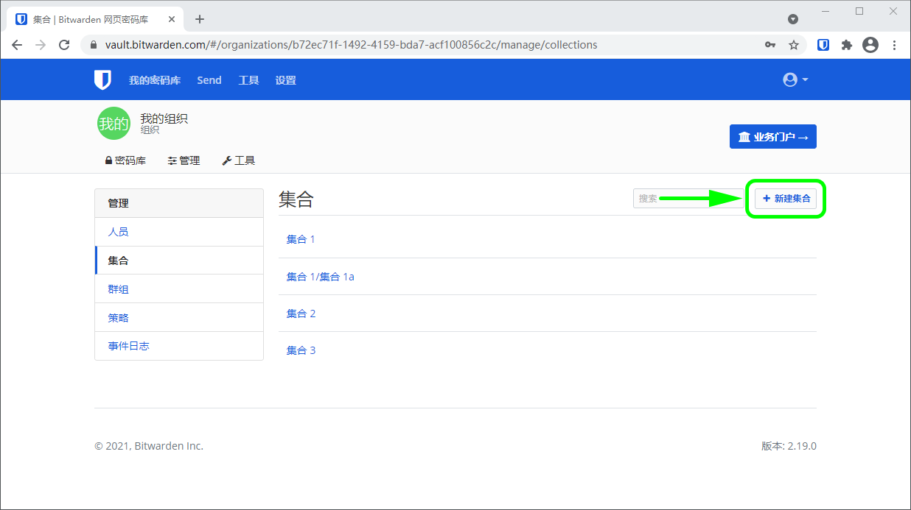
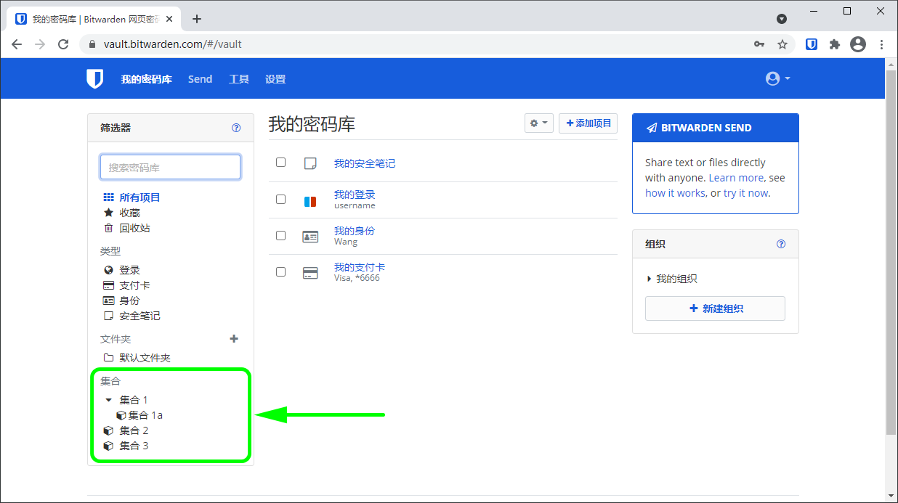
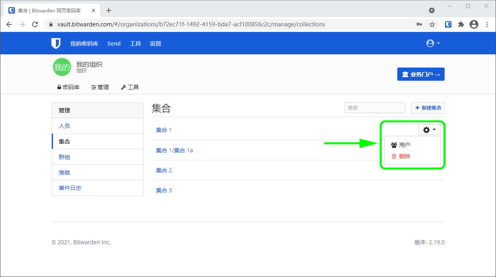

# 集合


对应的[官方文档地址](https://bitwarden.com/help/article/about-collections/)


## 什么是集合？ 

集合汇集了从组织内[安全共享](../../password-manager/vault-basics/sharing.md)的登录、笔记、支付卡和身份信息。把集合看作是组织 - 等价于用于组织个人密码库的[文件夹](../../password-manager/vault-administration/folders.md)，但有几个关键的区别：

* 组织通过将用户或[群组](groups.md)分配给集合来控制对组织所拥有的项目的访问。
* 组织所拥有的项目**必须**至少被包括在一个集合中。

### 使用集合 

对于许多组织来说，使用集合意味着添加一组密码库项目并将用户单独分配到该集合。构建可扩展集合的常见方式包括：**按部门集合**（比如来自营销团队的用户被分配到 **Marketing** 集合），或**按功能集合**（比如营销团队的用户被分配到 **Social Media** 集合）：


集合的使用


团队和企业组织也可以基于用户[群组](groups.md)，而不是单个用户来指定对集合的访问。群组 - 集合关联提供更深层次的访问控制和共享资源的可扩展性。一个常见的群组 - 集合方式是**按部门创建群组**和**按功能创建集合**，示例：


群组-集合的使用


其他常见的方式包括**按供应商或系统的集合**（比如 **Engineering** 群组的用户被分配到 **AWS Credentials** 集合）和**按地域的群组**（比如用户被分配到 **US Employees** 群组或 **UK Employees** 群组）。

## 创建集合 


与许多组织管理任务一样，创建集合**只能从网页密码库完成**。


组织的[经理（或更高级别）](../user-management/user-types-and-access-control.md)和[提供商用户](../../provider-portal/provider-users.md#provider-user-types)可以创建和管理集合。要创建集合：

1、登录到您的[网页密码库](https://vault.bitwarden.com/)并打开您的组织。

2、打开**管理**选项卡并选择 ✚**新建集合**按钮：

3、为您的集合输入一个**名称**，然后，如果是团队或企业组织，将**群组访问权限**分配给任何现有的[群组](groups.md)。


仅当您使用目录连接器时，**外部 ID** 字段才相关。


4、选择**保存**以完成集合的创建。

### 嵌套集合 

集合可以被「嵌套」，以用于在您的密码库中组织它们：

嵌套集合**仅用于显示目的**。嵌套的集合不会从他们的「父集合」中继承项目、访问或权限。

要创建嵌套的集合，遵循[上面的步骤](collections.md#create-a-collection)，但给您的集合一个**名称**，该名称包含「父」集合后跟一个正斜杠(`/`)分隔符，例如 `Collection 1/Collection 1a`。如果「父」集合不存在，其标题将完整显示。

## 管理集合 

你可能需要从一个集合中添加或删除用户，或者完全删除一个集合。这两种情况都可以在**管理** → **集合**视图中完成，方法是悬停在目标集合上并选择 **⚙️**齿轮下拉菜单：


删除一个集合**不会**删除该集合中的密码库项目。当一个集合被删除后，密码库项目将被移动到组织密码库视图中的**未分配**筛选器中。


### 在集合间移动项目 

有权访问组织内多个集合的用户可以将密码库项目从一个集合移动到另一个集合，或将密码库项目添加到多个集合。与[创建集合](collections.md#create-a-collection)不同，这可以从任何 Bitwarden 应用程序中完成：



要在集合之间移动项目：

1. 将鼠标悬停在密码库项目上并选择 **⚙️齿轮**图标。
2. 从下拉列表中选择**集合**。
3. 勾选要添加或移动项目的集合，然后选择**保存**。



要在集合之间移动项目：

1. 打开项目然后选择**编辑**。
2. 在编辑项目界面，选择**集合**。
3. 勾选要添加或移动项目的集合，然后选择**保存**。
4. 返回编辑项目界面，再次选择**保存**。



要在集合之间移动项目：

1. 打开项目然后选择**编辑**。
2. 点击选项（**≡）**菜单然后点击**集合**。
3. 点击要添加或移动项目的集合，然后点击**保存**。
4. 返回编辑项目界面，再次点击**保存**。



要在集合之间移动项目：

1. 打开项目然后选择 **✏️编辑**图标。
2. 在编辑项目界面，选择**集合**。
3. 点击要添加或移动项目的集合，然后选择**保存**图标。



要从 CLI 更改项目的集合，请使用 `edit` 命令。[了解更多](../../password-manager/getting-started/bitwarden-cli.md#edit)。



