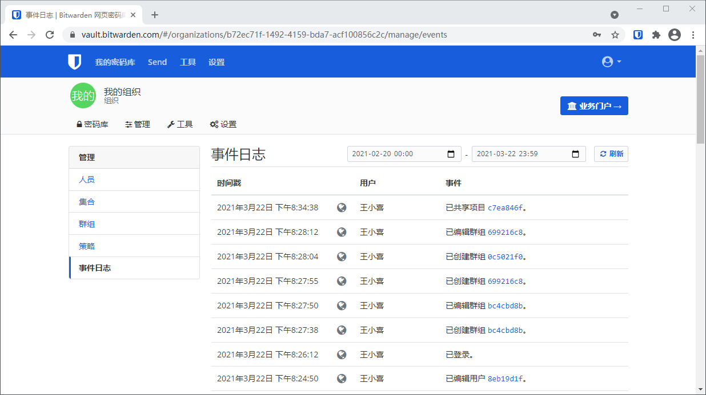

# 事件日志


对应的[官方文档地址](https://bitwarden.com/help/article/event-logs/)


## 什么是事件日志？ <a href="#what-are-event-logs" id="what-are-event-logs"></a>

事件日志是在您的组织内发生的事件的时间戳记录。[管理员和所有者](../user-management/user-types-and-access-control.md#user-types)可以从组织密码库的**管理**选项卡访问事件日志：



事件日志是可[导出](event-logs.md#export-events)的，也可以从 [Bitwarden 公共 API](../bitwarden-public-api.md) 的 `/events` 端点访问，并无限期保留。。

## 事件 <a href="#events" id="events"></a>

事件日志可以记录大约 40 种不同类型的事件。事件日志屏幕捕捉事件的**时间戳**、客户端应用程序信息（包括应用程序的类型和 IP （通过悬停在 **🌎**地球图标上访问）、连接到事件的**用户**以及**事件**的描述。


每种类型的**事件**都使用类型代码（`1000`、`1001` 等）关联，以标识事件所捕获的操作。[Bitwarden 公共 API](../bitwarden-public-api.md) 使用类型代码来标识被事件所记录的操作。


下面列出了所有事件类型及其相应的类型代码：

### 用户事件 <a href="#user-events" id="user-events"></a>

* Logged In. (`1000`)
* Changed account password. (`1001`)
* Enabled/updated two-step login. (`1002`)
* Disabled two-step login. (`1003`)
* Recovered account from two-step login. (`1004`)
* Login attempted failed with incorrect password. (`1005`)
* Login attempt failed with incorrect two-step login. (`1006`)
* User Exported their personal Vault items. (`1007`)
* User updated a password issued through [Admin Password Reset](../user-management/admin-password-reset.md). (`1008`)
* User migrated their decryption key with [Key Connector](../login-with-sso/key-connector/about-key-connector.md). (`1009`)

### 项目事件 <a href="#item-events" id="item-events"></a>

* Created item _item-identifier_. (`1100`)
* Edited item _item-identifier_. (`1101`)
* Permanently Deleted item _item-identifier_. (`1102`)
* Created attachment for item _item-identifier_. (`1103`)
* Deleted attachment for item _item-identifier_. (`1104`)
* Shared item _item-identifier_. (`1105`)
* Edited collections for item _item-identifier_ (`1106`)
* Viewed item _item-identifier_. (`1107`)
* Viewed password for item _item-identifier_. (`1108`)
* Viewed hidden field for item _item-identifier_. (`1109`)
* Viewed security code for item _item-identifier_. (`1110`)
* Copied password for item _item-identifier_. (`1111`)
* Copied hidden field for item _item-identifier_. (`1112`)
* Copied security code for item _item-identifier_. (`1113`)
* Auto-filled item _item-identifier_. (`1114`)
* Sent item _item-identifier_ to trash. (`1115`)
* Restored item _item-identifier_. (`1116`)
* Viewed Card Number for item item-identifier. (`1117`)

### 集合事件 <a href="#collection-events" id="collection-events"></a>

* Created collection _collection-identifier_. (`1300`)
* Edited collection _collection-identifier_. (`1301`)
* Deleted collection _collection-identifier_. (`1302`)

### 群组事件 <a href="#group-events" id="group-events"></a>

* Created group _group-identifier_. (`1400`)
* Edited group _group-identifier_. (`1401`)
* Deleted group _group-identifier_. (`1402`)

### 组织事件 <a href="#organization-events" id="organization-events"></a>

* Invited user _user-identifier_. (`1500`)
* Confirmed user _user-identifier_. (`1501`)
* Edited user _user-identifier_. (`1502`)
* Removed user _user-identifier_. (`1503`)
* Edited groups for user _user-identifier_. (`1504`)
* Unlinked SSO. (`1505`)
* _user-identifier_ enrolled in Master Password Reset. (`1506`)
* _user-identifier_ withdrew from Master Password Reset. (`1507`)
* Master Password was reset for _user-identifier_. (`1508`)
* Reset SSO link for user _user-identifier_. (`1509`)
* _user-identifer_ logged in using SSO for the first time. (`1510`)
* Revoked organization access for _user-identifier_ (`1511`)
* Restores organization access for _user-identifier_ (`1512`)
* Edited organization settings. (`1600`)
* Purged organization vault. (`1601`)
* Exported organization vault. (`1602`)
* Organization Vault access by a managing [Provider](../../provider-portal/provider-portal-overview.md). (`1603`)
* Organization enabled SSO. (`1604`)
* Organization disabled SSO. (`1605`)
* Organization enabled Key Connector. (`1606`)
* Organization disabled Key Connector. (`1607`)
* Families Sponsorships synced. (`1608`)
* Updated a Policy. (`1700`)

### 提供商事件 <a href="#provider-events" id="provider-events"></a>

当[管理提供商](../../provider-portal/provider-portal-overview.md)的成员触发上述任何事件时，**用户**栏将记录提供商的名称。此外，每当管理提供商的成员访问您的组织密码库时，专用于提供商的事件也将被记录：


提供商的访问事件


## 导出事件 <a href="#export-events" id="export-events"></a>

导出事件日志将创建一个包含指定日期范围内所有事件的 `.csv` 文件：


导出事件日志


示例：

```
message,appIcon,appName,userId,userName,userEmail,date,ip,type
Logged in.,fa-globe,Web Vault - Chrome,1234abcd-56de-78ef-91gh-abcdef123456,Alice,alice@bitwarden.com,2021-06-14T14:22:23.331751Z,111.11.111.111,User_LoggedIn
Invited user zyxw9876.,fa-globe,Unknown,1234abcd-56de-78ef-91gh-abcdef123456,Alice,alice@bitwarden.com,2021-06-14T14:14:44.7566667Z,111.11.111.111,OrganizationUser_Invited
Edited organization settings.,fa-globe,Web Vault - Chrome,9876dcba-65ed-87fe-19hg-654321fedcba,Bob,bob@bitwarden.com,2021-06-07T17:57:08.1866667Z,222.22.222.222,Organization_Updated
```

## API 响应 <a href="#api-responses" id="api-responses"></a>

从 [Bitwarden 公共 API](../bitwarden-public-api.md) 的 `/events` 端点访问事件日志将返回 JSON 响应，例如下面这样：

```python
{
  "object": "list",
  "data": [
    {
      "object": "event",
      "type": 1000,
      "itemId": "string",
      "collectionId": "string",
      "groupId": "string",
      "policyId": "string",
      "memberId": "string",
      "actingUserId": "string",
      "date": "2020-11-04T15:01:21.698Z",
      "device": 0,
      "ipAddress": "xxx.xx.xxx.x"
    }
  ],
  "continuationToken": "string"
}
```

## [SIEM](https://en.wikipedia.org/wiki/Security\_information\_and\_event\_management) 和外部系统集成 <a href="#siem-and-external-systems-integrations" id="siem-and-external-systems-integrations"></a>

当将数据从 Bitwarden 导出到其他系统时，可以使用 API​​ 和 CLI 的组合数据来收集数据。

例如，Bitwarden RESTful API 围绕组织结构收集数据。

* GET /public/members：返回成员、ID 和分配的群组 ID
* GET /public/groups：返回所有群组、ID、分配的集合及其权限
* GET /public/collections：返回所有集合及其分配的群组

获得每个成员、群组和集合的唯一 ID 之后，您现在就可以使用 CLI 工具通过 CLI 命令 `bw-list` 来收集信息，该命令以 JSON 格式检索以下项目：

* 组织成员
* 项目
* 集合
* 群组

在收集这些数据后，您可以将行连接到它们唯一的 ID 上，以建立对您的 Bitwarden 组织所有部分的参考。有关使用 Bitwarden CLI 的更多信息，请参阅 [Bitwarden 命令行工具（CLI）](../../password-manager/getting-started/bitwarden-cli.md)。
