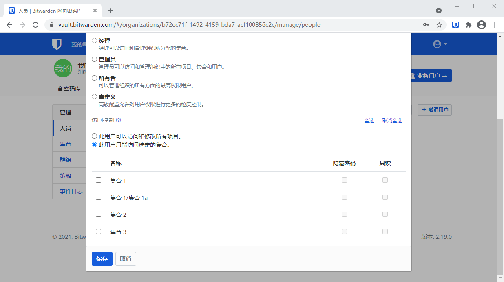

# =成员角色和权限


对应的[官方文档地址](https://bitwarden.com/help/article/user-types-access-control/)


Bitwarden 组织中的用户可以被授予各种用户类型和访问控制，以管理他们的权限和访问。当[邀请用户到您的组织](../../organizations/user-management.md)时，您可以设置用户类型和访问控制，或者在任何时候从您的组织的**管理** → **人员**界面进行设置：


编辑用户类型和访问控制


## 用户类型 

用户类型决定了一个用户在您的组织内将拥有的权限。用户类型并不决定[他们可以访问哪些集合](member-roles-and-permissions.md#access-control)，而是决定他们在您的组织的资源和工具范围内**可以获取哪些操作**。选项包括：

| 用户类型 | 权限                                                                                                                                                                       |
| ---- | ------------------------------------------------------------------------------------------------------------------------------------------------------------------------ |
| 用户   | 
访问指定集合中的共享项目

从分配的集合中添加、编辑或删除项目（除非<strong>只读</strong>）
                                                                                                       |
| 经理   | 
上述所有的权限，

+将用户分配给集合

+将用户群组分配给集合

+创建或删除集合
                                                                                                         |
| 管理员  | 
上述所有的权限，

+将用户分配给用户群组

+创建或删除用户群组

+邀请并确认新用户

+管理企业策略

+查看事件日志

+导出组织密码库数据

+管理密码重置

<strong>管理员用户自动拥有所有集合的访问权限。</strong>
 |
| 所有者  | 
上述所有的权限，

+管理计费、订阅和集成

<strong>所有者用户自动拥有所有集合的访问权限。</strong>
                                                                                             |
| 自定义  | 允许逐个用户地对用户权限进行粒度控制，请参阅[自定义角色](member-roles-and-permissions.md#custom-role)。                                                                                              |


**仅所有者**可以创建新的所有者，或分配所有者类型到一个现有的用户。为了进行故障转移，Bitwarden 建议创建多个所有者用户。


### 自定义角色 

为用户选择**自定义**角色可以逐个用户地精细控制权限。自定义角色的用户拥有经理和管理员功能的配置选择能力，包括：

* 管理已分配的集合（提供以下 2 个选项）
  * 编辑已分配的集合
  * 删除已分配的集合
* 访问事件日志
* 访问导入/导出
* 访问报告
* 管理所有集合（提供以下 3 个选项）
  * 创建新的集合
  * 编辑任何集合
  * 删除任何集合
* 管理群组
* 管理 SSO
* 管理策略
* 管理用户
* 管理密码重置


例如，自定义角色允许创建只能管理 SSO 配置和访问相关凭证的用户。这种情况下，此场景可做如下所示设置：



## 访问控制 

访问控制决定了对集合的访问权限，以及每个单独集合内部的权限：


回顾一下，[管理员和所有者](member-roles-and-permissions.md#user-types)可以自动获得访问所有集合的权限。对于其他用户类型，配置访问控制将决定哪些集合可以在他们的个人密码库和客户端应用程序（浏览器扩展、移动端等等）中随时访问。管理员和所有者仍然能够从组织密码库中访问「未分配」的集合。


| 访问控制               | 描述                                                                     |
| ------------------ | ---------------------------------------------------------------------- |
| **此用户可以访问和修改所有项目** | 
授予用户对所有集合的访问权限，以及修改其中存储的密码库项目的能力。

选择此选项将折叠集合选择部分。
  |
| **此用户只能访问选定的集合**   | 
仅授予用户对选定集合的访问权限，以及对每一个集合的粒度访问控制权限。

选择此选项将展开集合选择部分。
 |

### 粒度访问控制 

如果您选择了**此用户只能访问选定的集合**，请选择要为其提供访问权限的集合。对于每一个集合，您还可以配置以下选项：

| 选项       | 描述                                                                                                                                                                         |
| -------- | -------------------------------------------------------------------------------------------------------------------------------------------------------------------------- |
| **隐藏密码** | 
防止用户查看或复制所有密码、TOTP 种子以及隐藏的自定义字段。启用<strong>隐藏密码</strong>的用户只能通过自动填充使用集合中的项目。

<strong>隐藏密码</strong>可防止轻松复制​​和粘贴隐藏的项目，但它并不能完全阻止用户访问此信息。像对待任何共享凭证一样对待隐藏密码。
 |
| **只读**   | 防止用户添加、编辑或删除集合中的项目。具有**只读**访问权限的用户仍然可以查看和使用所有密码、TOTP 种子以及隐藏的自定义字段。                                                                                                         |
