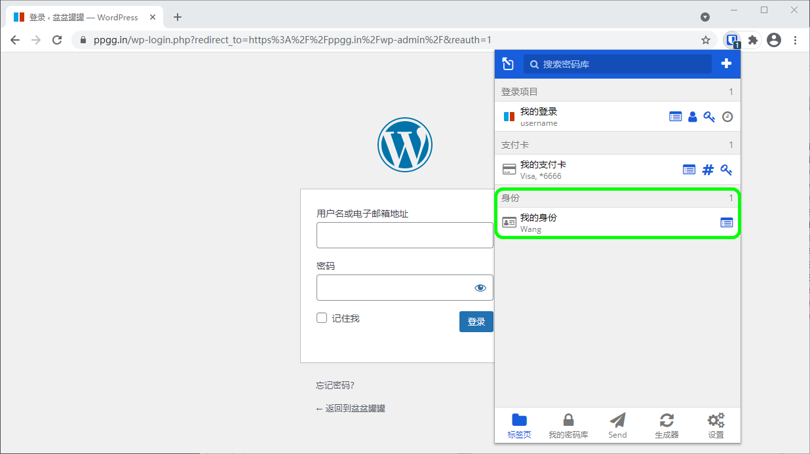

# 自动填充支付卡和身份


对应的[官方文档地址](https://bitwarden.com/help/article/auto-fill-card-id/)


Bitwarden 不止于[自动填充用户名和密码](auto-fill-logins-in-browser-extensions.md)！**Bitwarden 浏览器扩展**可以使用独特的选项卡视图自动填写支付卡和身份信息，以简化网上购物、账户创建等。


目前，自动填充支付卡和身份的功能**仅适用于浏览器扩展**。诸如 Android 和 iOS 之类的移动平台不支持这些类型的自动填充。


## 自动填充支付卡和身份 

要自动填充支付卡和身份：

1、打开浏览器扩展，或者，如果您的浏览器扩展已经打开，请导航至 **📁选项卡**视图。

除非您[从该视图中隐藏了支付卡和/或身份](auto-fill-cards-and-identities.md#hide-cards-and-identities)，否则所有支付卡和身份将在此处与所有[匹配的登录项目](using-uris.md)一起列出。

2、选择您想要自动填充的支付卡或身份：

浏览器扩展将在网页上找到任何映射到支付卡或身份信息的字段，并自动填充它们。

## 隐藏支付卡和身份 

如果您不希望将支付卡和身份用于自动填充，则可以禁用在 **📁选项卡**视图中显示：

1. 在浏览器扩展中，打开 **⚙️设置**标签。
2. 向下滚动到**其他**部分，选择**选项**。
3. 向下滚动并勾选**标签页上不显示支付卡**和/或**标签页上不显示身份**复选框。
