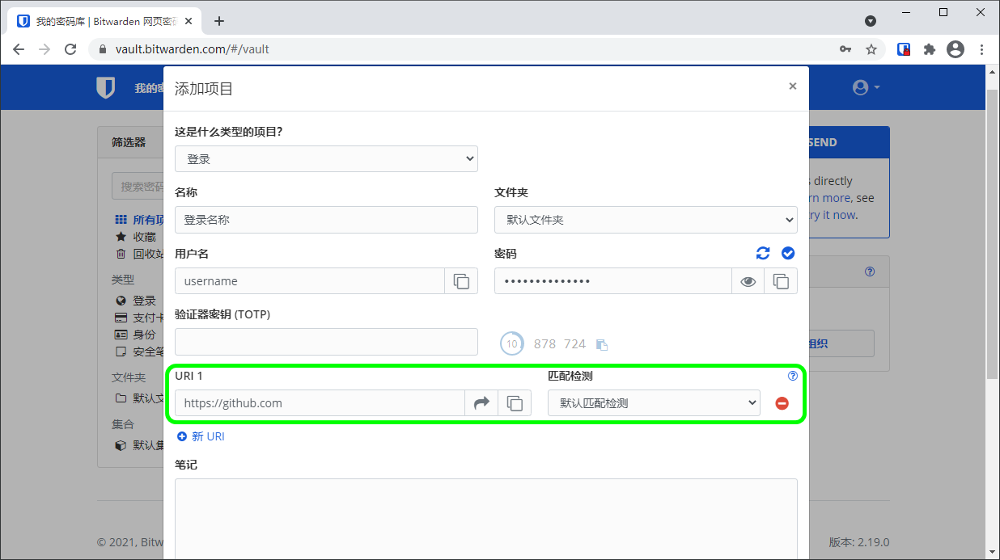

# URI 的使用


对应的[官方文档地址](https://bitwarden.com/help/article/uri-match-detection/)


密码库中的任何登录项目都可以被创建或编辑为包含一个或多个 URI（Uniform Resource Identifier：统一资源标识符）。URI 可以是网站地址（即 URL）、服务器 IP 地址、移动应用程序包 ID 等。


如果您希望在各种 Bitwarden 客户端应用程序中使用自动填充功能，则需要为登录项目指定 URI。


## URI 方案 

完整的 URI 在开头应包含一个方案，例如 `https://` 方案用来安全地引用网站地址。如果未指定方案，则假定为 `http://`。


大多数 Bitwarden 客户端应用程序允许您直接从密码库 ⮫**启动**网站或应用程序。没有此方案，启动功能将无法正常工作。


方案包括：

* `http://` 或 `https://` 引用网站地址（例如：`https://www.github.com`）
* `androidapp://` 引用 Android 应用程序的包 ID 或名称（例如：`androidapp://com.twitter.android`）


为 Android 应用程序获取正确的 URI 的一种简单方法是访问 Google Play 商店中的应用程序页面，点击共享按钮，然后将复制的链接粘贴到您方便阅读的地方。此链接看起来类似于 `https://play.google.com/store/apps/details?id=com.twitter.android`，`id=` 之后的值就是您的 URI，在本示例中为 `com.twitter.android`。[了解更多](../password-manager/auto-fill/blocking-autofill.md#android-app-uris)。


## 匹配检测选项 

分配给登录项目的每一个 URI 都有一个关联的**匹配检测**选项。该选项决定了 Bitwarden 何时以及是否将此登录作为自动填充的可用选项，这通常是通过与具体的组成部分的匹配来确定的。下图对 URI 的组成部分进行了分解：


URI 示意图


### 默认匹配检测 

Bitwarden 浏览器扩展和移动应用程序可以通过导航到 **⚙️设置** → **选项** → **默认 URI 匹配检测**，从下面列出的选项中选择一个**默认匹配检测**行为。您也可以为各个项目设置匹配检测行为，这将覆盖全局默认值。

默认情况下，Bitwarden 使用**基础域**匹配作为默认选项。

### 基础域 

选择**基础域**，当登录项目的 URI 值的顶级域名和第二级名与检测到的资源相匹配时，Bitwarden 将弹出提示以提供自动填充。

例如，URI 的值为 `https://google.com`，使用基础域匹配检测：

| URL                         | 自动填充？  |
| --------------------------- | ------ |
| http://google.com           | **✔︎** |
| https://accounts.google.com | **✔︎** |
| https://google.net          | **✘**  |
| http://yahoo.com            | **✘**  |

### 主机 

选择**主机**，当登录项目的 URI 值的主机名和端口（若指定了）与检测到的资源相匹配时，Bitwarden 将弹出提示以提供自动填充。

例如，URI 的值为 `https://sub.domain.com:4000`，使用主机匹配检测：

| URL                                   | 自动填充？  |
| ------------------------------------- | ------ |
| http://sub.domain.com:4000            | **✔︎** |
| https://sub.domain.com:4000/page.html | **✔︎** |
| https://domain.com                    | **✘**  |
| https://sub.domain.com                | **✘**  |
| https://sub2.sub.domain.com:4000      | **✘**  |
| https://sub.domain.com:5000           | **✘**  |

### 开始于 

选择**开始于**，当检测到的资源以登录项目的 URI 值开头（无论后面跟什么）时，Bitwarden 将弹出提示以提供自动填充。

例如，URI 的值为 `https://sub.domain.com/path/`，使用开始于匹配检测：

| URL                                                | 自动填充？  |
| -------------------------------------------------- | ------ |
| https://sub.domain.com/path/                       | **✔︎** |
| https://sub.domain.com/path/page.html              | **✔︎** |
| https://sub.domain.com                             | **✘**  |
| https://sub.domain.com:4000/path/page.html（被端口阻断了） | **✘**  |
| https://sub.domain.com/path（缺少斜杠）                  | **✘**  |

### 正则表达式 


正则表达式是一个高级选项，如果使用不正确，可能会非常危险。如果您完全不知道自己在做什么，则不应使用此选项。


选择**正则表达式**，当检测到的资源与一个指定的[正则表达式](https://zh.wikipedia.org/wiki/%E6%AD%A3%E5%88%99%E8%A1%A8%E8%BE%BE%E5%BC%8F)相匹配时，Bitwarden 将弹出提示以提供自动填充。正则表达&#x5F0F;_&#x59CB;终不区分大小写_。

#### 不安全示例 

URI 的值为 `^https://.*google\.com$`，使用正则表达式匹配检测：

| URL                                     | 自动填充？  |
| --------------------------------------- | ------ |
| https://google.com                      | **✔︎** |
| https://sub.google.com                  | **✔︎** |
| https://malicious-site.com?q=google.com | **✔︎** |
| http://google.com                       | **✘**  |
| https://yahoo.com                       | **✘**  |

这可能比预期的要匹配得更多。考虑避免使用句号(`.`)，除非转义(`\`)，否则任何字符都会匹配。

#### 安全示例 

URI 的值为 `^https://[a-z]+\.wikipedia\.org/w/index\.php`，使用正则表达式匹配检测：

| URL                                                                              | 自动填充？  |
| -------------------------------------------------------------------------------- | ------ |
| https://en.wikipedia.org/w/index.php?title=Special:UserLogin\&returnto=Bitwarden | **✔︎** |
| https://pl.wikipedia.org/w/index.php?title=Specjalna:Zaloguj\&returnto=Bitwarden | **✔︎** |
| https://en.wikipedia.org/w/index.php                                             | **✔︎** |
| https://malicious-site.com                                                       | **✘**  |
| https://en.wikipedia.org/wiki/Bitwarden                                          | **✘**  |

### 精确 

选择**精确**，当登录项目的 URI 值与检测到的资源精确匹配时，Bitwarden 将弹出提示以提供自动填充。

例如，URI 的值为 `https://www.google.com/page.html`，使用精确匹配检测：

| URL                                        | 自动填充？  |
| ------------------------------------------ | ------ |
| https://www.google.com/page.html           | **✔︎** |
| http://www.google.com/page.html            | **✘**  |
| https://www.google.com/page.html?query=123 | **✘**  |
| https://www.google.com                     | **✘**  |

### 从不 

选择**从不**，Bitwarden 将从不为登录项目弹出以提供自动填充。
