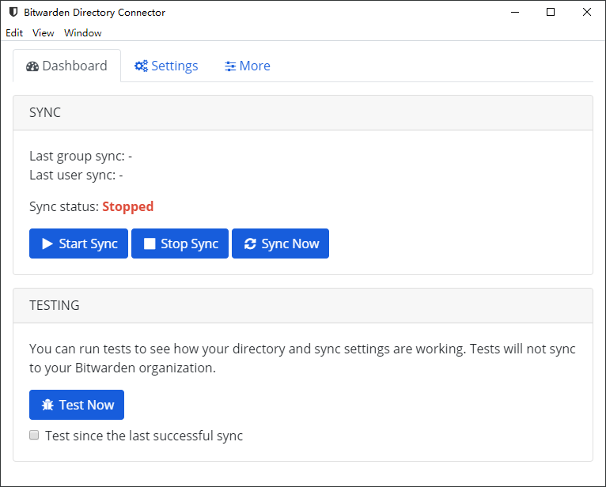

# 关于目录连接器


对应的[官方文档地址](https://bitwarden.com/help/article/directory-sync/)


## 什么是目录连接器？ 

Bitwarden Directory Connector（Bitwarden 目录连接器）应用程序用于将用户和群组从一个选择的目录服务中同步到 Bitwarden 组织。目录连接器会从源目录**自动布建和取消布建用户、群组以及群组关联**。

目录连接器将向同步的用户发出邀请，但它不会根据存储在源目录中的任何凭证自动构建 Bitwarden 凭证。被邀请的用户需要遵循正常的组织[入职流程](../organizations/user-management.md#onboard-users)，并使用已创建的 Bitwarden 主密码登录。


目录连接器功能适用于**团队**和**企业**组织。要使用目录连接器，您必须有权访问您的[组织 API 密钥](../organizations/bitwarden-public-api.md#authentication)，该密钥只​​能由[组织所有者](../admin-console/user-management/member-roles-and-permissions.md)获取并使用 [Bitwarden Send](../bitwarden-send/about-send.md) 安全共享。



目录连接器图示


目录连接器同步操作可以按需运行，也可以按配置的时间间隔自动运行。目录连接器应用程序可以作为代理安装在托管目录的服务器、管理员的工作站或任何其他可以访问源目录的桌面设备上。

目录连接器支持从以下来源同步：

* [Active Directory](sync-with-active-directory-or-ldap.md)
* [任何基于 LDAP 的目录](sync-with-active-directory-or-ldap.md)
* [Azure Active Directory](sync-with-azure-ad.md)
* [G Suite（Google）](sync-with-google-workspace.md)
* [Okta](sync-with-okta.md)
* [OneLogin](sync-with-onelogin.md)

## 目录连接器应用程序 

目录连接器可作为跨平台的[桌面应用程序](directory-connector-desktop-app.md)和[命令行界面（CLI）](directory-connector-cli.md)使用。桌面版应用程序和 CLI [共享数据库和配置](directory-connector-file-storage.md)，因此您可以选择使用这两者之一，但是不建议同时使用。

## 下载目录连接器 

使用下面的链接下载目录连接器。



从我们的 [GitHub 发布页面](https://github.com/bitwarden/directory-connector/releases)或使用以下官方链接下载最新版本的目录连接器桌面版应用程序：

*  [ Windows Installer（.exe）](https://vault.bitwarden.com/download/?app=connector\&platform=windows)
*  [ Windows Portable（.exe）](https://vault.bitwarden.com/download/?app=connector\&platform=windows\&variant=portable)
*  [ macOS（.dmg）](https://vault.bitwarden.com/download/?app=connector\&platform=macos)
*  [ Linux（.AppImage）](https://vault.bitwarden.com/download/?app=connector\&platform=linux)



从以下链接下载最新版本的目录连接器 CLI：

* [ Windows CLI（.exe）](https://vault.bitwarden.com/download/?app=connector\&platform=windows\&variant=cli-zip)
* [ macOS CLI](https://vault.bitwarden.com/download/?app=connector\&platform=macos\&variant=cli-zip)
* [ Linux CLI](https://vault.bitwarden.com/download/?app=connector\&platform=linux\&variant=cli-zip)



## 源代码 

与 Bitwarden 的所有内容一样，目录连接器也是开源的，并托管在 GitHub 的[https://github.com/bitwarden/directory-connector](https://github.com/bitwarden/directory-connector) 上。
