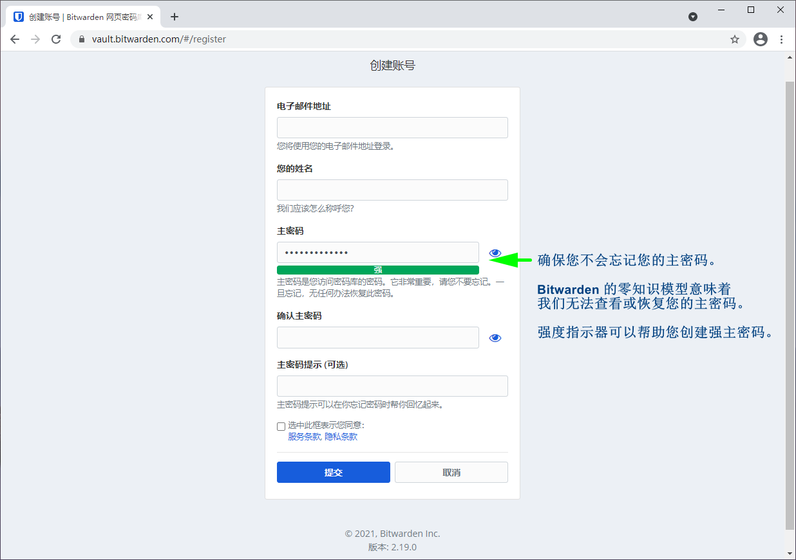

# 创建 Bitwarden 账户


对应的[官方文档地址](https://bitwarden.com/help/article/create-bitwarden-account/)


很高兴我们能成为您的密码安全管理之旅的一部分。要创建 Bitwarden 账户，请点击我们主页上的 **Get Started** 按钮，或者点击[这里](https://vault.bitwarden.com/#/register)。


Bitwarden 主页


## 创建您的账户 

点击链接后，将出现如下界面。填写完所有的字段（_主密码提示_是可选的）后，点击**提交**。

### 通过组织邀请创建账户 

组织可以邀请用户注册 Bitwarden。如果您受邀加入某个组织：

1. 检查您的电子邮件是否收到来自 Bitwarden 的加入该组织的邀请。在电子邮件过期前打开它并选择**立即加入组织**。
2. 您将被重定向到 Bitwarden 网站。如果您还没有 Bitwarden 帐户，请选择**创建帐户**。
3. 按照[创建您的账户](create-bitwarden-account.md#create-your-account)部分中的步骤完成注册。邀请中提供的电子邮件将自动填充在注册页面上。
4. 完成注册后，选择**提交**然后登录。

创建帐户后，组织管理员将需要确认您的成员身份，然后您才能查看组织数据。

## 验证您的电子邮件 

创建账户后，登录您的[网页密码库](https://vault.bitwarden.com/)并选择右上角的**验证电子邮件**按钮，Bitwarden 将向您发送一封验证电子邮件。

## 下一步 

现在您已经创建了您的帐户，我们建议：

* [网页密码库使用入门](getting-started-webvault.md)
* [在其他设备上安装 Bitwarden](https://bitwarden.com/download/)
