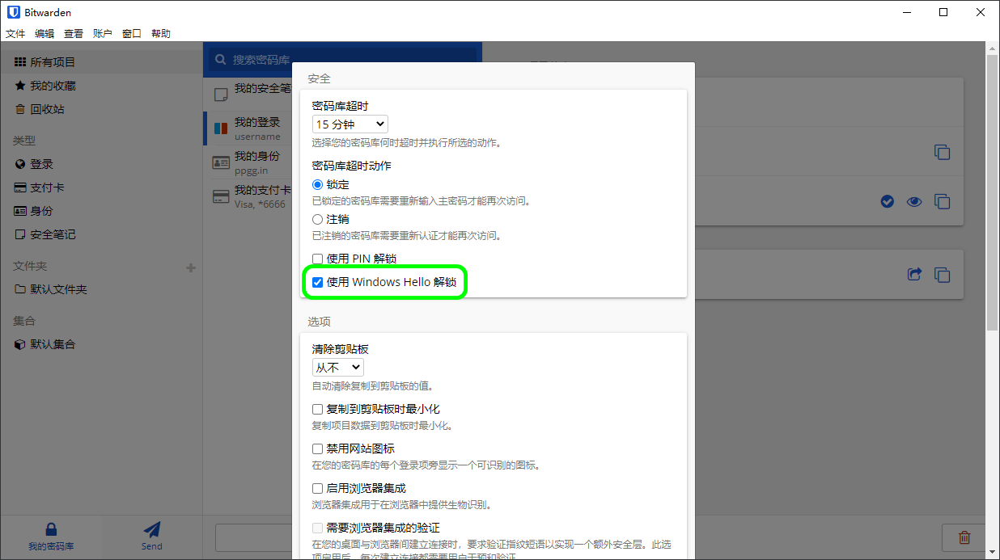

# 桌面应用程序入门


对应的[官方文档地址](https://bitwarden.com/help/article/getting-started-desktop)


Bitwarden 的桌面应用程序将完整的密码库体验从浏览器直接带入您的桌面。桌面应用程序一次支持最多 5 个已登录的账户，可以随时在个人账户和工作账户之间轻松切换（[了解更多](../your-vault/account-switching.md)）。

在 **🔒我的密码库**视图中，您可以浏览您的所有项目，包括您所属的组织拥有的项目。使用密码库下拉列表来筛选**所有密码库**、**我的密码库**和任何组织密码库中的项目。


Bitwarden 桌面应用程序


## 第一步 

让我们通过将一个新的登录项目添加到您的密码库并确保其安全且易于查找来开始您的 Bitwarden 桌面应用程序之旅：

### 创建一个文件夹 

文件夹是确保您在需要使用时始终可以找到密码库项目的好方法。要创建一个文件夹：

1. 在桌面应用程序的第一列中，选择**文件夹**旁边的 ✚**添加**图标。
2. 给您的新文件夹起个名字（例如 `Social Media`），然后选择 **💾保存**。

### 添加一个登录项目 

现在，让我们添加一个登录项目到您的新文件夹中。要创建新的登录项目：

1. 在中间列中，选择 ✚**添加**图标。添加项目面板将显示在第三列中。
2. 选择要添加的项目的类型（这里我们选择**登录**）。
3. 输入这个新项目的基本信息：
   * 帮助您轻松识别它的**名称**（例如 `Twitter Account`）
   * 您的**用户名**。
   * 您的当前**密码**（我们待会会用一个强大的替换它）。
4. 选择 ✚**新建 URI** 按钮，然后输入您登录账户的 URL（例如 `https://twitter.com/login`）。
5. 从文件夹下拉列表中选择一个**文件夹**，如果您按照我们的示例进行操作，请选择我们刚刚创建的 **Social Media** 文件夹！
6. 很好！选择 **💾保存**以完成。

### 生成一个强密码 

现在，您已经保存了一个新的登录项目，让我们使用一个强密码替换您的密码来提高它的安全性：

1、打开网页浏览器并使用您现有的用户名和密码登录该账户。在该账户中，找到可以**更改密码**的位置。

2、在**更改密码**表单上，输入您的**当前密码**，您可以使用 **❐复制**图标从 Bitwarden 复制并粘贴该密码。

3、在 Bitwarden 中，在你的项目上选择 **✏️编辑**。

4、在密码框中，选择 **⟳生成**然后**确认**以覆盖您的旧密码。

这将使用随机生成的强密码替换您的密码。从 `Fido1234` 更改为 `X@Ln@x9J@&u@5n##B` 可以阻止潜在的黑客攻击。

5、选择 **💾保存**。

6、使用之前使用的 **❐复制**图标复制新的密码，然后将新的密码粘贴到网页浏览器的**新密码**和**确认新密码**字段中。

7、完成后，在网页浏览器中选择**保存**。

恭喜！您的登录项目现已安全且易于使用地保存在 Bitwarden 中了！

### 添加第二个账户 

您是否有多个 Bitwarden 账户？例如一个用于个人使用，一个用于工作。桌面应用程序可以一次性同时登录 5 个账户！

要登录第二个账户，请从桌面应用程序的右上角选择当前已登录的账户，然后选择 ✚**添加账户**：


桌面应账户切换


登录第二个账户后，您可以从同一菜单中快速切换它们，该菜单还将显示每一个账户的密码库的当前状态（_已锁定_或_已解锁_）。如果您注销其中一个账户，它将从此列表中移除。

## 下一步

现在您已经掌握了基础知识，您可以自定义您的桌面应用程序以完全按照您希望的方式工作：



### 设置您的首选项 

要设置您的首选项，请从菜单栏中选择**文件** → **设置**。您会注意到三个部分：**安全性**、**首选项**和**应用程序设置**。


**安全性**和**首选项**适用于[活动账户](getting-started-desktop.md#add-a-second-account)，应为每个账户单独设置。**应用程序设置**适用于所有账户。


### 使用生物识别解锁 

桌面应用程序最受欢迎的设置之一是[使用生物识别解锁](../your-vault/unlocking-with-biometrics.md)，它允许使用带 PIN 的 [Windows Hello](https://docs.microsoft.com/zh-cn/windows-hardware/design/device-experiences/windows-hello)、面部识别或[其他符合 Windows Hello 生物识别要求的硬件](https://docs.microsoft.com/zh-cn/windows-hardware/design/device-experiences/windows-hello-biometric-requirements)无缝访问您的桌面应用程序。要设置生物识别解锁：


Windows 用户可能需要安装 [Microsoft Visual C ++ Redistributable](https://support.microsoft.com/zh-cn/topic/%E6%9C%80%E6%96%B0%E6%94%AF%E6%8C%81%E7%9A%84-visual-c-%E4%B8%8B%E8%BD%BD-2647da03-1eea-4433-9aff-95f26a218cc0)，然后才能在桌面偏好设置中开启 Windows Hello。


1、在您的计算机上启用 Windows Hello。

2、如果您的计算机支持并已启用 Windows Hello，在**安全性**部分中将显示**使用 Windows Hello 解锁**选项：

选中**使用 Windows Hello 解锁**选项以继续。您的计算机将提示您输入您的生物特征。

3、启用后，使用**使用 Windows Hello 解锁**按钮来解锁您的密码库。

记住，**安全性**设置是针对每一个账户设置的，因此如果您想为另一个账户启用生物识别解锁，您需要再次执行这些步骤！

### 自动启动 Bitwarden 

另一个有用的功能是在启动计算机时始终启动 Bitwarden。要启用此功能，请导航到**应用程序设置**部分并勾选**登录时自动启动**复选框。

与生物识别不同，此设置适用于所有已登录的账户！



### 设置您的偏好设置 

要设置您的偏好设置，请从菜单栏中选择**Bitwarden** → **偏好设置**。您会注意到三个部分：**安全性**、**偏好设置**和**应用程序设置**。


**安全性**和**偏好设置**适用于[活动账户](getting-started-desktop.md#add-a-second-account)，应为每个账户单独设置。**应用程序设置**适用于所有账户。


### 使用生物识别解锁 

桌面应用程序最受欢迎的设置之一是[使用生物识别解锁](../your-vault/unlocking-with-biometrics.md)，它允许使用**触控 ID** 技术无缝访问您的桌面应用程序。要设置生物识别解锁：

1、在您的计算机上启用触控 ID。请参阅 Apple 的[触控 ID 文档](https://support.apple.com/en-us/HT207054)以获取帮助。

2、如果您的计算机支持并已启用了触控 ID，在**安全性**部分中将显示**使用触控 ID 解锁**选项：

选中**使用触控 ID 解锁**选项以继续。您的计算机将提示您输入您的指纹。

3、启用后，使用**使用触控 ID 解锁**按钮来解锁您的密码库。


使用触控 ID 解锁


记住，**安全性**设置是针对每一个账户设置的，因此如果您想为另一个账户启用生物识别解锁，您需要再次执行这些步骤！

### 自动启动 Bitwarden 

另一个有用的功能是在启动计算机时始终启动 Bitwarden。要启用此功能，请导航到**应用程序设置**部分并勾选**登录时自动启动**复选框。

与生物识别不同，此设置适用于所有已登录的账户账户！



### 设置您的首选项 

要设置您的首选项，请从菜单栏中选择**文件** → **设置**。您会注意到三个部分：**安全性**、**首选项**和**应用程序设置**。


**安全性**和**首选项**适用于[活动账户](getting-started-desktop.md#add-a-second-account)，应为每个账户单独设置。**应用程序设置**适用于所有账户。


### 自动启动 Bitwarden 

另一个有用的功能是在启动计算机时始终启动 Bitwarden。要启用此功能，请导航到**应用程序设置**部分并勾选**登录时自动启动**复选框。

与生物识别不同，此设置适用于所有已登录的账户！


