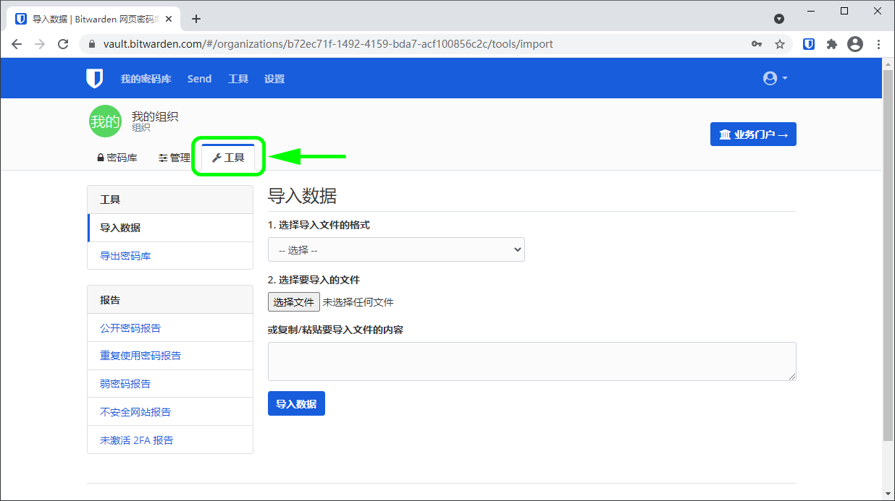
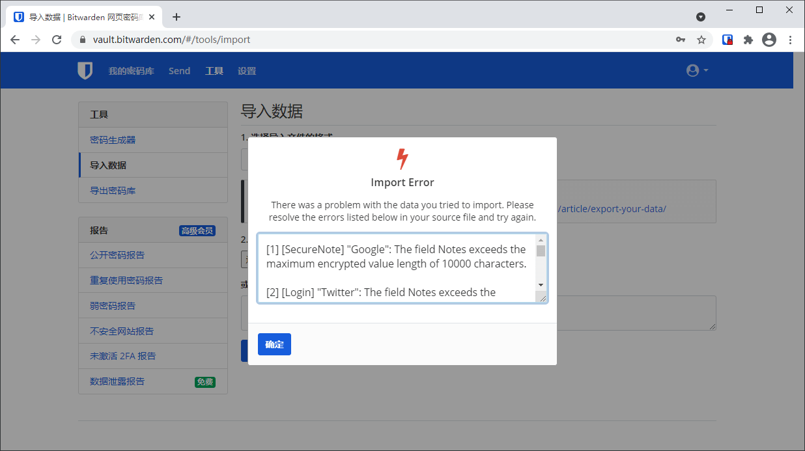

# 导入数据到组织


对应的[官方文档地址](https://bitwarden.com/help/article/import-to-org/)


Bitwarden 提供了一个数据导入工具，可以轻松地将任何密码管理解决方案迁移到您的组织密码库。您也可以使用数据导入工具从一个 Bitwarden 密码库导入到另一个 Bitwarden 密码库，或者导入一个 Bitwarden [加密导出](encrypted-exports.md)。

关于支持的导入格式的完整列表，请参阅 [Bitwarden 支持导入哪些文件格式？](import-and-export-faqs.md#q-what-file-formats-does-bitwarden-support-for-import)，或者使用这些文章用于从最流行的解决方案导入：

* [从 LastPass 导入](../password-manager/import-and-export/import-guides/import-data-from-lastpass.md)
* [从1Password 导入](../password-manager/import-and-export/import-guides/import-data-from-1password.md)
* [从 Firefox 导入](../password-manager/import-and-export/import-guides/import-data-from-firefox.md)
* [从 Google Chrome 导入](../password-manager/import-and-export/import-guides/import-data-from-google-chrome.md)


**上面列出的文章**描述如何导入到个人 Bitwarden 密码库。虽然从每一个解决方案中导出的指导是适当的，但重要的是要知道，导入到组织的过程略有不同，并在[下面进行了记录](import-data-to-an-organization.md#import-to-your-organization)。


## 导入到您的组织 

**只能从**[**网页密码库**](../getting-started/getting-started-webvault.md)**或** [**CLI**](../password-manager/developer-tools/password-manager-cli.md#import) **完成**导入数据到 Bitwarden 的操作。数据在发送到服务器存储之前会在本地进行加密。要导入您的数据：

1、在您的组织中导航到**工具**选项卡

2、从左侧工具菜单选择**导入数据**

3、从格式下拉菜单，选择一个**文件格式**（参阅 [Bitwarden 支持导入哪些文件格式？](import-and-export-faqs.md#q-what-file-formats-does-bitwarden-support-for-import)）

4、选择**选择文件**按钮并添加一个文件用于导入

5、选择**导入数据**按钮以完成导入


导入到 Bitwarden 无法检查要导入的文件中的项目是否与您的密码库中的项目重复。这意味着，如果某个项目已同时存在于密码库和要导入的文件中，则**多次导入将创建重复的密码库项目**。


目前，文件附件不包括在 Bitwarden 导入操作中，需要手动上传至您的密码库。有关更多信息，请参阅[文件附件](../your-vault/file-attachments.md)。

## 长度相关的导入错误 

尝试导入 `.csv` 时通常会收到以下错误信息，这些信息表明导入文件中的某个特定值超出了该字段类型所允许的**加密**字符的限制：

要解决这个问题，请在文本编辑器或电子表格程序中打开 `.csv` 文件，将违规项目**移除**或**减少其字符数**。Bitwarden 不会导入您的 `.csv` 文件直到无任何违规项目。错误信息中的内容包含了几条相关的数据，这可以帮助你识别违规项目。例如，在上面的示例中：

* `[1]` 标识违规项目所在的索引号，调整后&#x4E0E;_&#x5927;多&#x6570;_&#x7535;子表格程序中的行号一致
* `[Login]` 标识违规项目的项目`类型`
* `"Google"` 、`"Twitter"` 标识违规项目的`名称`
* `Notes` 标识超过字符数限制的字段（列）
* `10000` 标识该字段（列）允许的字符数限制


在导入到 Bitwarden 时，任何给定字段的字符数都会因为被加密而增加，比如`.csv` 中具有 8000 个字符的`备注`字段在与 Bitwarden 接触时，会扩展到 10000 多个字符，从而触发这个错误。根据经验法则，加密后字符数会增长 30-50%。


如果您在使用错误信息中提供的数据来查找违规项目时遇到问题，可以首先将重点放在备注上，因为备注通常会导致此错误。
