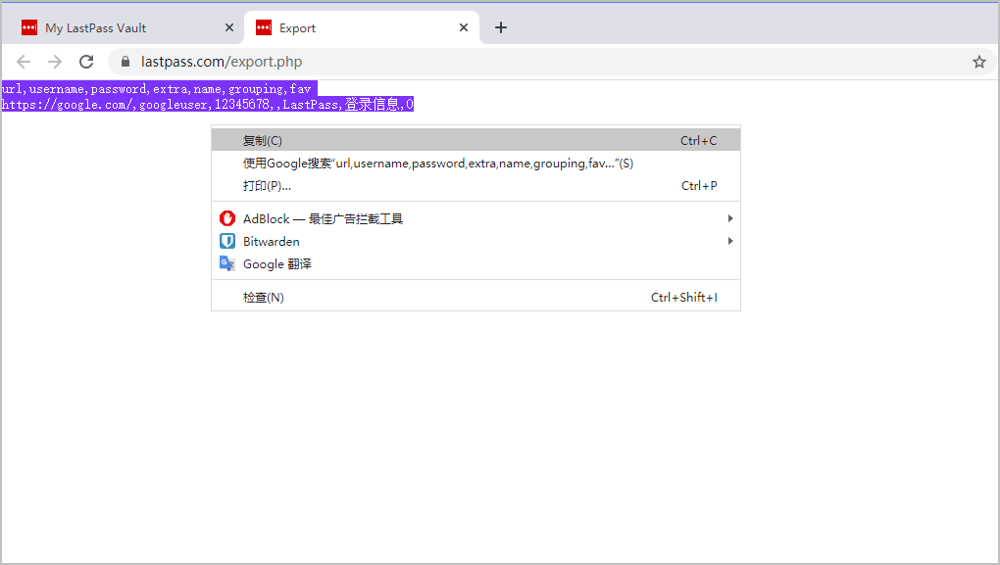

# 从 LastPass 导入数据


对应的[官方文档地址](https://bitwarden.com/help/article/import-from-lastpass/)


使用这篇文章帮助您从 LastPass 导出数据并将其导入 Bitwarden 中。

## 从 LastPass 导出 <a href="#export-from-lastpass" id="export-from-lastpass"></a>

您可以从 LastPass 的网页密码库或从 LastPass 浏览器扩展导出数据：



要从 LastPass 网页密码库导出您的数据：

1、从左侧边栏选择 **🚀Advanced Options** 选项。


从网页密码库导出


2、从管理您的密码库部分，选择 **Export** 选项。此时，LastPass 将向您发送一封电子邮件以确认导出。

3、在您的收件箱中，确认此导出操作，返回到您的 LastPass 网页密码库，并再次选择 **Export** 选项以完成导出。

根据您的浏览器，您的密码库数据将自动保存为 `.csv` 文件或以 `.csv` 格式显示在屏幕上：


LastPass 导出


4、如果您的密码库数据显示在屏幕上，全选显示的数据，将其复制并粘帖到一个新的 `export.csv` 文件中。


**一些用户报告了一个 bug**：密码中的特殊字符（`&`、`<`、`>` 等）在导出时，被更改成了 HTML 编码的值（如，`&amp;`）。

如果你在导出的数据中发现了这个 bug，请在导入 Bitwarden 之前，使用文本编辑器查找并替换所有被更改的值。




要从 LastPass 浏览器扩展导出您的数据：

1、在浏览器扩展中，导航到 **Account Options** → **Advanced** → **Export** → **LastPass CSV File：**


从浏览器扩展导出


2、输入您的主密码以验证导出尝试。

根据您的浏览器，您的密码库数据将自动保存为 `.csv` 文件或以 `.csv` 格式显示在屏幕上：



3、如果您的密码库数据显示在屏幕上，全选显示的数据，将其复制并粘帖到一个新的 `export.csv` 文件中。



## 导入到 Bitwarden <a href="#import-to-bitwarden" id="import-to-bitwarden"></a>

**数据必须从网页密码库或 CLI 导入到 Bitwarden**。数据在发送到服务器存储之前会在本地进行[加密](../../security/encryption.md)。



要导入数据到您的密码库：

1、通过 [https://vault.bitwarden.com](https://vault.bitwarden.com) 或自托管的 `https://your.bitwarden.domain.com` 登录到网页密码库。

2、从顶部导航条选择**工具**。

3、从工具菜单选择**导入数据**。

4、从格式下拉菜单，选择一个[文件格式](../import-and-export-faqs.md#q-what-file-formats-does-bitwarden-support-for-import) 。

5、选择**选择文件**按钮并添加一个文件用于导入，或将文件内容**复制/粘贴**到输入框中。


导入时不会检查要导入的文件中的项目是否已存在于您的密码库中，因此**多次导入文件或导入具有已存在于密码库中的项目的文件将创建重复项目**。


6、选择**导入数据**按钮以开始导入。

7、成功导入后，从您的计算机中将导入源文件删除。这将在您的计算机受到威胁时为您提供保护。

[文件附件](../../your-vault/file-attachments.md)需要手动上传到您的密码库。



要通过 CLI 将数据导入您的密码库，请使用以下命令：

```shell
bw import <format> <path>
```

`bw import` 命令需要格式（使用 `bw import --formats` 获取格式列表）和路径，例如：

```shell
bw import lastpasscsv /Users/myaccount/Documents/mydata.csv
```

成功导入后，从您的计算机中将导入源文件删除。这将在您的计算机受到威胁时为您提供保护。



## 导入故障排除 <a href="#import-troubleshooting" id="import-troubleshooting"></a>

### 长度相关的导入错误 <a href="#length-related-import-errors" id="length-related-import-errors"></a>

尝试导入 `.csv` 时通常会收到以下错误信息，这些信息表明导入文件中的某个特定值超出了该字段类型所允许的**加密**字符的限制：


要解决这个问题，请在文本编辑器或电子表格程序中打开 `.csv` 文件，将违规项目**移除**或**减少其字符数**。Bitwarden 不会导入您的 `.csv` 文件直到无任何违规项目。错误信息中的内容包含了几条相关的数据，这可以帮助你识别违规项目。例如，在上面的示例中：

* `[1]` 标识违规项目所在的索引号，调整后与_大多数_电子表格程序中的行号一致
* `[Login]` 标识违规项目的项目`类型`
* `"Google"` 、`"Twitter"` 标识违规项目的`名称`
* `Notes` 标识超过字符数限制的字段（列）
* `10000` 标识该字段（列）允许的字符数限制


在导入到 Bitwarden 时，任何给定字段的字符数都会因为被加密而增加，比如`.csv` 中具有 8000 个字符的`备注`字段在与 Bitwarden 接触时，会扩展到 10000 多个字符，从而触发这个错误。根据经验，加密后字符数会增长 30-50%。


如果您在使用错误信息中提供的数据来查找违规项目时遇到问题，可以首先将重点放在备注上，因为备注通常会导致此错误。

### 最大集合错误 <a href="#maximum-collections-error" id="maximum-collections-error"></a>

当将 Lastpass 的 `.csv` 导出文件导入到[免费组织](../../plans-and-pricing/about-bitwarden-plans.md)时，您可能会看到如下错误：


免费组织最大集合错误


当 Lastpass 导出包含 3 个或更多 `grouping` 值时，就会发生该错误。`grouping` 字段中的值被 Bitwarden 解释为[集合](../../organizations/collections.md)，但[免费组织](../../plans-and-pricing/about-bitwarden-plans.md)限制为仅两个集合。例如，下面的 `.csv` 将导致该错误：

```
url,username,password,totp,extra,name,grouping,fav
https://www.facebook.com/login.php,username,password,,,Facebook,Social,0
https://twitter.com/login,username,password,,,Twitter,Social,0
https://asana.com/,login,password,,,Asana,Productivity Tools,0
https://github.com/login,username,password,,,Github,Productivity Tools,0
https://www.paypal.com/login,username,password,,,Paypal,Finance,0
https://www.bankofamerica.com/,username,password,,,Bankofamerica,Finance,0
```

**要解决这个问题**，删除每个项目的 `grouping` 列和 `grouping` 基准，包括后面的逗号，例如，编辑：

```
https://github.com/login,username,password,,,Github,Productivity Tools,0
```

将其减少为：

```
https://github.com/login,username,password,,,Github,0
```
