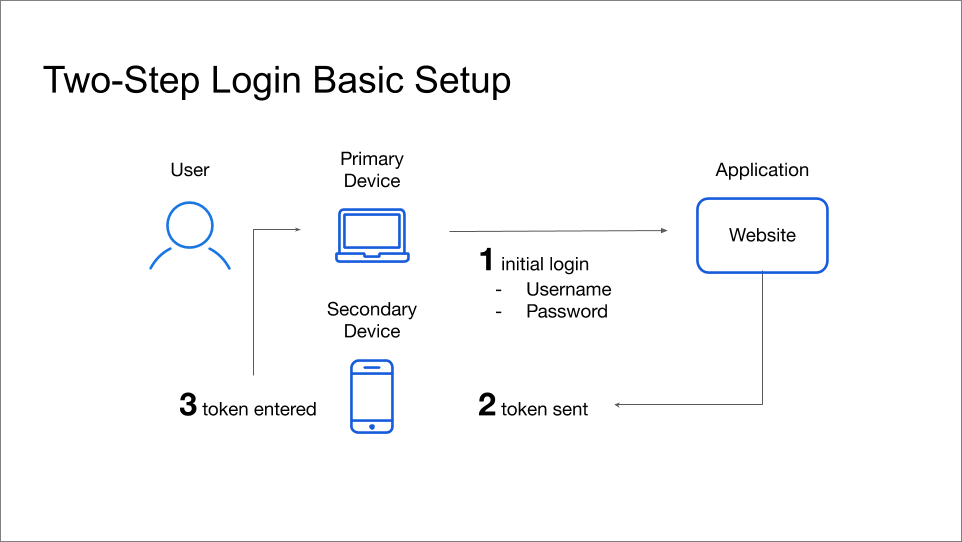
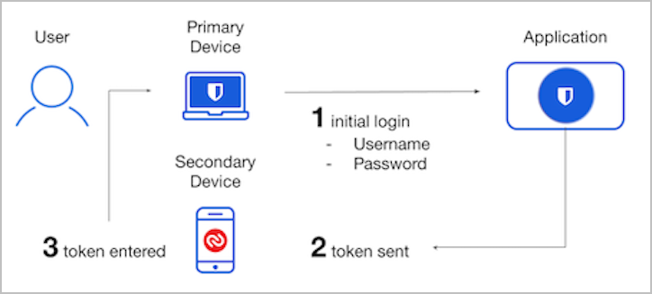
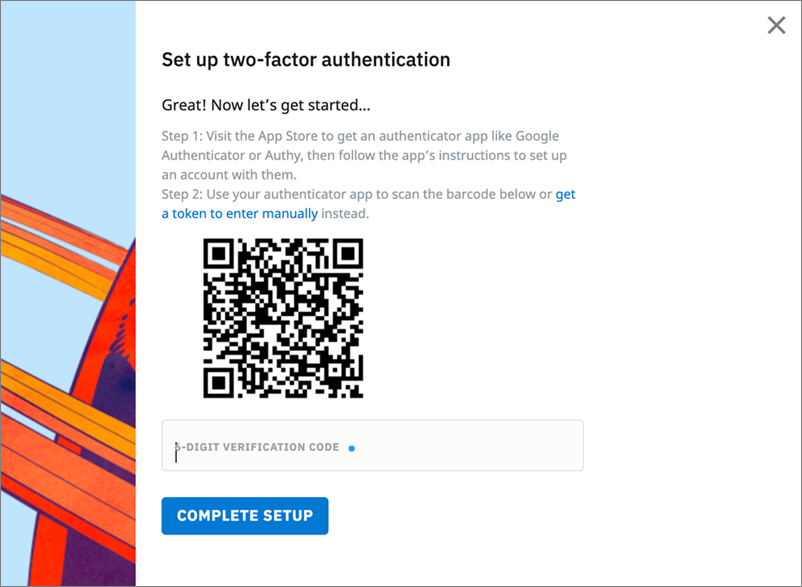
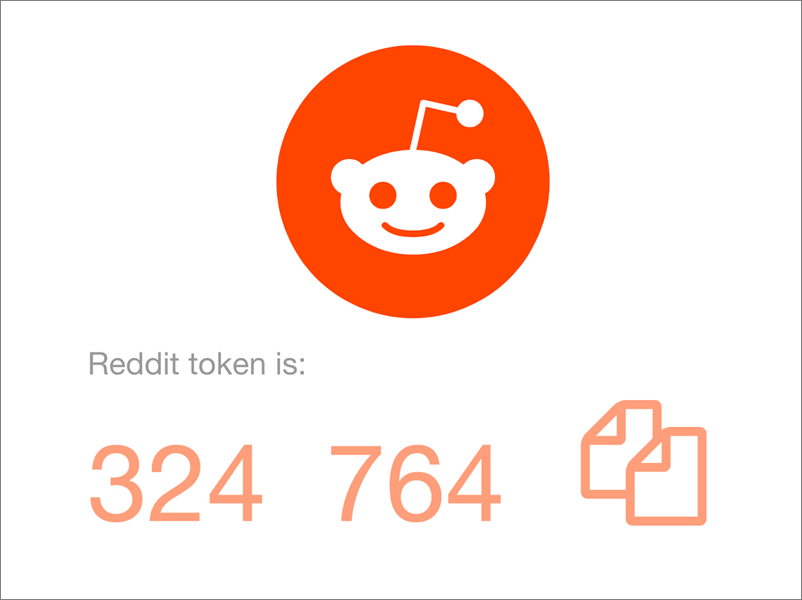
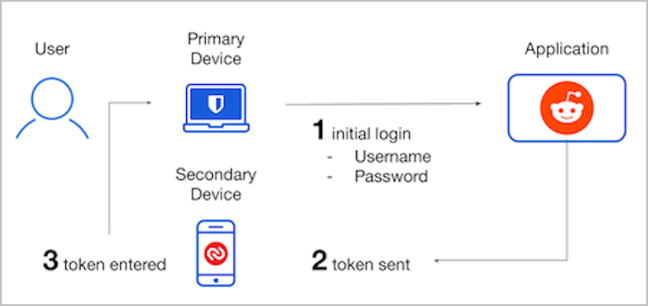
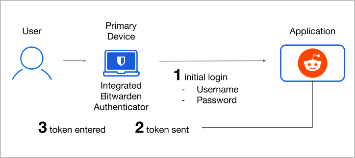

# 两步登录现场指南


对应的[官方文档地址](https://bitwarden.com/help/article/bitwarden-field-guide-two-step-login/)


## 什么是两步登录？ 

两步登录（也称为_双因素验证_或 _2FA_）是一种越来越常见的安全技术，被网站和应用程序用来保护您的敏感数据。使用两步登录的网站会要求您除了输入用户名和密码外，还要输入一个额外的「令牌」（也称为_验证码_或_一次性密码（OTP）_）来验证您的身份，该令牌通常从不同的设备上获取。

如果他们无法从您的**辅助设备**上访问令牌，恶意行为者即使知道了您的用户名和密码，他们也无法访问网站：

通常情况下，拥有敏感数据的网站或应用程序（例如，您的在线银行账户）会试图在登录屏幕之外验证您的身份，比如使用如下方式之一：

* 将包含令牌的 SMS/文本信息发送到移动设备上
* 要求提供由移动设备上的验证器应用程序（例如 Authy）生成的令牌
* 从物理安全钥匙（例如 Yubikey）中查找令牌

## 如何使用两步登录？ 

安全性通常需要在保护和便利之间进行权衡，因此最终取决于您！通常，使用两步登录的两个最关键的用途：

**1、**[**保护 Bitwarden** ](field-guide-for-two-step-login.md#securing-bitwarden)

Bitwarden 支持多种两步登录方式，您可以使用这些方式来保护密码库数据的安全。启用两步登录后，将要求您在每次**登录**时，除了输入主密码外，还要完成第二步。

**2、**[**保护重要的网站**](field-guide-for-two-step-login.md#securing-important-websites)

在使用 Bitwarden 密码库项目登录网站时，您可以使用多种两步登录方式来验证您的身份。在这篇文章中，我们将讨论如何使用 Authy 和 **Bitwarden 内置的验证器**进行两步登录。&#x20;

## 保护 Bitwarden 

由于您的密码管理器存储了您的所有登录信息，我们强烈建议您使用两步登录来保护它。这样做可以保护您的所有登录信息，以防止恶意行为者访问您的密码库，即使他们获取了您的主密码。

启用两步登录将要求您在每次登录时，除了输入您的主密码外，还要完成第二步。解锁密码库时您无需完成第二步，仅登录时需要。

**Bitwarden 为免费账户提供了好几种两步登录方式**，包括：

* 验证器应用程序（例如，Authy 或 Google 验证器）
* 电子邮件

**对于高级会员账户**，Bitwarden 还提供了好几种高级两步登录方式：

* 具有 Duo Push、短信、电话和安全钥匙的 Duo Security
* YubiKey（任何 4/5 系列设备或 YubiKey NEO/NFC）
* FIDO（任何经过 FIDO2 WebAuthn 认证的钥匙）

要了解有关选项的更多信息，或获取设置任何方式的帮助，请参阅[两步登录方式](two-step-login-methods.md)。

## 保护重要的网站 

Bitwarden 可能不是你使用的唯一一个具有两步登录选项的网站或应用，两步登录选项对于存储敏感信息（例如，信用卡或银行账号）的网站特别有用。可以在大多数具有两步登录选项的网站的**设置**、**安全**或**隐私**菜单中找到它。

激活两步登录时，通常会打开一个二维码，比如 Reddit 的这个：

使用验证器应用程序扫描这个代码后，就能使程序生成轮换的 6 位数令牌，你可以用此令牌来验证你的身份，比如这个由 Authy 生成的令牌：

### 使用 Authy 

要使用 Authy 设置 Reddit 的两步登录，请点击**添加账户**按钮，并扫描您的网站或应用程序呈现的二维码。扫描二维码将生成你的 6 位数令牌。在**验证码**输入框中输入此代码，即可完成使用 Authy 的两步登录设置。

通常，你会得到下载恢复代码的选项。下载恢复代码对于防止你失去对两步登录令牌的访问至关重要，即使你丢失安装了 Authy 的设备。

下次登录 Reddit 时，你会被要求输入来自 Authy 的验证码来验证身份。验证码每 30 秒轮换一次，所以恶意行为者在无法访问你的物理设备的情况下，将无法获取你的代码。


Authy 是 Bitwarden 推荐的验证器应用程序，因为它拥有任一个设备的验证器备份功能。即使你丢失了安装 Authy 的设备，备份也能防止你失去对两步登录令牌的访问。在 Authy 程序的  **Accounts** 界面打开 **Authenticator Backups** 开关，即可使用该功能。

其他验证器应用程序包括 [Google Authenticator](https://support.google.com/accounts/answer/1066447?hl=en) 和 [FreeOTP](https://freeotp.github.io/)，_从2020年5月7日起，Google Authenticator 包含了验证码在跨 Android 设备上的可移植性功能_。


### 使用 Bitwarden 验证器 

**作为 Authy 的替代方案**，Bitwarden 为包括付费组织（家庭、团队或企业）成员在内的高级用户提供了一个内置的验证器。

与其他验证器应用一样，iOS 版和 Android 版的 Bitwarden 可以扫描二维码并生成 6 位数的令牌。使用 Bitwarden 验证器来保护网站的安全时，将保存一个与该登录项目一起轮换的 6 位数令牌。您也可以手动从任何 Bitwarden 应用中将您的验证码加密保存到密码库项目中。

有关设置和使用 Bitwarden 验证器的更多信息，请参阅 [Bitwarden 验证器](../../password-manager/vault-basics/totp.md)。

### 为何要使用 Bitwarden 验证器？ 

可以理解的是，一些用户对使用 Bitwarden 进行令牌认证持怀疑态度。请记住，安全往往涉及到保护和便利之间的权衡，所以最好的解决方案取决于你自己。一般来说，使用 Bitwarden 验证器有两个原因：

**1、便利性**

Bitwarden 移动应用和浏览器扩展提供自动填写验证码的功能。当您使用 Bitwarden 自动填写用户名和密码时，它会自动将验证码复制到您的剪贴板上，以方便粘贴。

如果您使用的是浏览器扩展，您可以将登录键盘快捷键（Windows：`Ctrl + Shift + L` / macOS：`Cmd + Shift + L`）和粘贴快捷键（Windows：`Ctrl + V` / macOS：`Cmd + V`）连在一起，实现快速登录。

**2、共享**

对于组织来说，使用 Bitwarden 验证器进行令牌验证的一大好处是能够在团队成员之间共享生成的令牌。这使得组织可以通过两步登录保护他们的账户，而不会牺牲多个用户访问该账户的能力，也不需要两个员工之间协调以不安全的方式共享令牌。

## 后续步骤 

现在你已经是两步登录的专家了，我们建议你：

* [设置两步登录](two-step-login-methods.md)
* [获取高级会员以使用高级两步登录方式](https://vault.bitwarden.com/#/?premium=purchase)
* [设置 Bitwarden 验证器](../../password-manager/vault-basics/totp.md)
