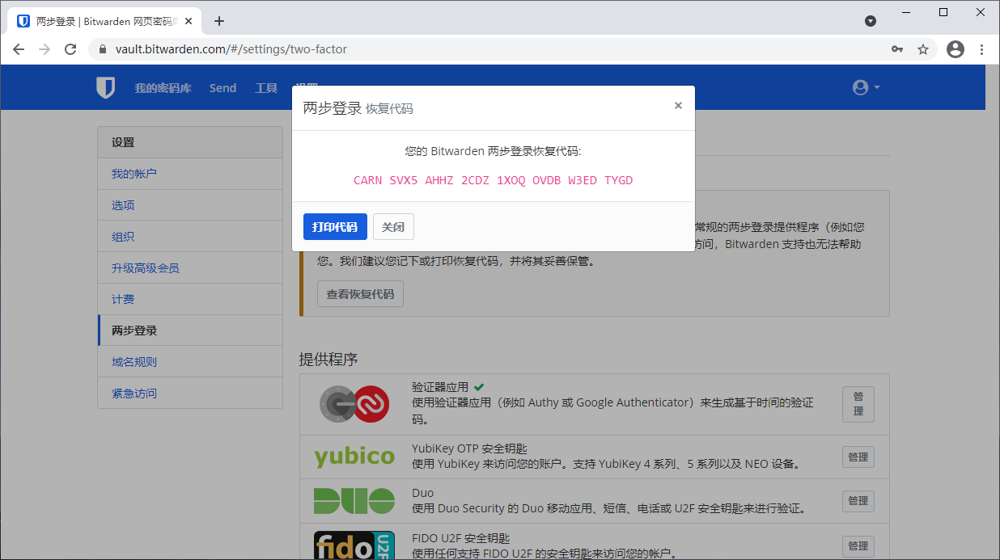

# 恢复代码


对应的[官方文档地址](https://bitwarden.com/help/article/two-step-recovery-code/)


如果您启用了任何[两步登录方式](two-step-login-methods.md)，重要的是要明白，失去对您的辅助设备（如安装了验证器的移动设备、安全钥匙、或已链接的电子邮件收件箱）的访问，有可能将您锁定在您的 Bitwarden 密码库之外。

为了防止这种情况的发生，Bitwarden 生成了一个**恢复代码**，它可以和您的主密码一起使用，以从您的密码库外部禁用任何已启用的两步登录方式。


启用任何两步登录方式之后，应**立即**[获取您的恢复代码](recovery-codes.md#get-your-recovery-code)。此外，每次[使用](recovery-codes.md#use-your-recovery-code)后都要重新获取一个新的恢复代码，因为每次被使用后它都会更改。


## 获取您的恢复代码 

要获取您的恢复代码：

1. 登录到您的网页密码库。
2. 从上方导航栏选择**设置**。
3. 从左侧设置菜单选择**两步登录**。
4. 从屏幕上方选择**查看恢复代码**。将提示您输入您的主密码，然后将打开恢复代码面板：

以最适合您的方式保存您的恢复代码。不管是否相信，打印代码并将其保存在安全的地方是确保代码不易被盗窃或无意删除的最佳方式之一。


**恢复代码什么时候会更改？**

禁用和重新启用两步登陆或更改您的主密码都不会更改您的恢复代码。恢复代码只会[在它被您使用后](recovery-codes.md#use-your-recovery-code)更改。使用恢复代码后，请立即获取一个新的代码，并使用对您最有意义的方式进行保存。


## 使用您的恢复代码 

要使用您的恢复代码，请导航到 [`https://vault.bitwarden.com/#/recover-2fa`](https://vault.bitwarden.com/#/recover-2fa)（或者，如果是自托管安装，请导航到 `https://your.vault.domain.com/#/recover-2fa`）。

使用恢复代码与正常的登录过程相同，需要提供您的电子邮件地址和主密码，但也需要提供您的恢复代码。三者都验证成功后，您将登录进您的密码库同时**所有的两步登录方式将被禁用**。

**使用后需重新获取新的恢复代码，因为每次使用后它都会更改**。此时，您还应该重新启用你想在未来使用的任何两步登陆方式。


恢复代码**不会禁用用于组织的 Duo**。您可以通过**（组织）**头部来判断 Duo 提示是否是组织层面的，如下截图所示：

.png>)

如果 **Duo（Organization）**提示窗口提示您被锁定在您的密码库之外了，请与您公司的 Duo 管理员联系，以帮助绕过此提示。

