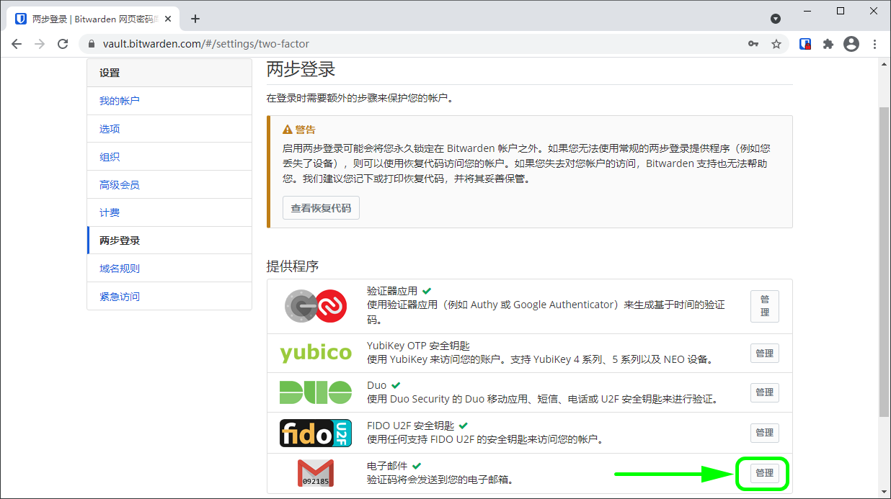

# 两步登录-电子邮件


对应的[官方文档地址](https://bitwarden.com/help/article/setup-two-step-login-email/)


电子邮件方式的两步登录对于所有 Bitwarden 用户是免费的。


如果您使用 SSO 登录，则不建议使用电子邮件方式的两步登录，因为使用多个方法会导致错误。可以考虑改为设置[免费的验证器应用程序方式的两步登录](two-step-login-via-authenticator.md)。


## 设置电子邮件验证 

要启用电子邮件方式的两步登录：


**丢失对两步登录所绑定的电子邮件的访问会永久性将您锁定在您的帐户之外**，除非您将您的两步登录恢复代码写下并将其保存在安全的地方，或拥有已启用并可用的备用两步登录方式。

启用任何方式之后，应立即通过**两步登录**界面[获取您的恢复代码](../recovery-codes.md)。


1、登录您的[网页密码库](https://vault.bitwarden.com/)。

2、从顶部导航栏选择**设置**。

3、从侧左菜单选择**两步登录**。

4、定位到**电子邮件**选项并选择**管理**按钮：

输入主密码以继续。

5、输入您用于接收验证码的电子邮件地址，然后点击**发送电子邮件**按钮。


如果您有多个电子邮件地址，用于两步登录的地址不必使用与注册 Bitwarden 时使用的地址相同。


6、检查您的收件箱接收到的 6 位验证码，将此代码填入网页密码库的对话框中并选择**启用**按钮。

一个绿色的`已启用`信息表明电子邮件方式的两步登录已被启用。

7、单击**关闭**按钮，并确认**电子邮件**选项现在已被启用（通过一个绿色勾号 **✔️** 指示）。


我们建议在继续测试两步登录之前保持活动的网页密码库选项卡为打开状态，以防出现配置错误的情况。当您确认它正常工作后，你应该注销所有的 Bitwarden 应用程序，以为每个应用程序立即激活两步登录。您最终会被自动注销。


## 使用电子邮件验证 

以下内容假设**电子邮件**是您[已启用的最高优先级方式](../two-step-login-methods.md#using-multiple-methods)。完成以下步骤，以使用两步登录访问您的密码库：

1、在任一个 Bitwarden 应用程序上输入您的电子邮件地址和主密码以登录密码库。\
将提示您**输入发送到你配置的电子邮件的 6 位验证码**。

2、检查您的收件箱接收到的 6 位数验证码。在密码库登录界面输入此代码。


勾选**记住我**方框，以记住您的设备，为期30天。记住你的设备意味着你不会被要求完成两步登陆步骤。


3、选择**继续**以完成登录。

登录后，您将不会被要求完成第二步的两步登录步骤就可以**解锁**您的密码库。有关配置注销和锁定行为的帮助，请参阅[密码库超时选项](../../log-in-and-unlock/vault-timeout-options.md)。
