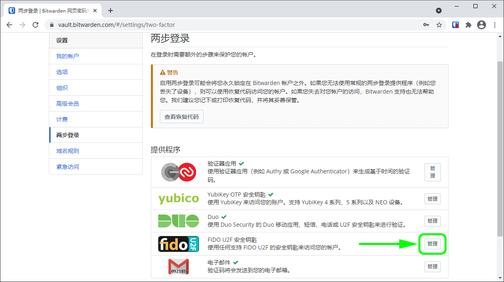
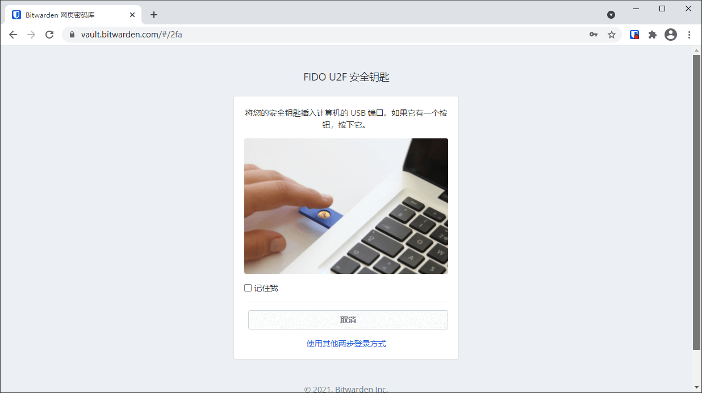

# 两步登录-FIDO2 WebAuthn


对应的[官方文档地址](https://bitwarden.com/help/article/setup-two-step-login-u2f/)


> **\[译者注]**：
>
> * FIDO：Fast IDentity Online，在线快速身份认证。FIDO 是一套身份认证框架协议，由 [FIDO 联盟](https://fidoalliance.org/)维护并制定相应的技术规范和标准。
> * [U2F](https://zh.wikipedia.org/wiki/%E9%80%9A%E7%94%A8%E7%AC%AC%E4%BA%8C%E5%9B%A0%E7%B4%A0)：Universal 2nd Factor，通用第二因素。由 [FIDO 联盟](https://fidoalliance.org/)制定的一个开放认证标准，使用专门的 USB 或 NFC 设备来加强并简化双重认证。
> * [Yubiley](https://zh.wikipedia.org/wiki/YubiKey)：YubiKey 是由 [Yubico](https://www.yubico.com/) 公司生产的用于身份认证的硬件设备。部分 Yubikey 型号支持 FIDO。其他支持 FIDO 的硬件还有 Google 的 [Titan 安全钥匙](https://cloud.google.com/titan-security-key)、FEITIAN 的[安全钥匙](https://www.ftsafe.com/Products/FIDO)等。

FIDO2 WebAuthn 方式的两步登录适用于高级用户，包括付费组织（家庭、团队或企业）的成员。&#x20;

可以使用任何经过 FIDO2 WebAuthn 认证的验证器，包括 [YubiKey](https://www.yubico.com/)、[SoloKeys](https://solokeys.com/)、[Google Titan](https://store.google.com/product/titan\_security\_key)、[Nitrokey](https://www.nitrokey.com/) 等安全钥匙，以及 Windows Hello 和 Touch ID 等本机生物识别选项。


已存在的 FIDO U2F 安全钥匙仍将可用，其在两步登录 → 管理 FIDO2 WebAuthn 对话框中被标记为**（迁移自 FIDO）**。


FIDO2 WebAuthn 不能在所有 Bitwarden 应用程序上使用。您应该额外启用另一种两步登录方式，以便在不受支持的应用程序上访问您的密码库。支持的应用程序：

* 具有[支持 FIDO2](https://fidoalliance.org/fido2/fido2-web-authentication-webauthn/) 的浏览器的设备上的**网页密码库**
* [支持 FIDO2](https://fidoalliance.org/fido2/fido2-web-authentication-webauthn/) 的浏览器上的**浏览器扩展**
* Windows 10 及以上的**桌面应用程序**
* 具有[支持 FIDO2](https://fidoalliance.org/fido2/fido2-web-authentication-webauthn/) 的浏览器的 Android 和 iOS 13.3+ 上的**移动应用程序**

## 设置 FIDO2 WebAuthn 


**丢失对您的验证器的访问会永久性将您锁定在您的帐户之外**。除非您将您的两步登录恢复代码写下并将其保存在安全的地方，或拥有已启用并可用的备用两步登录方式。

启用任何方式之后，应立即通过**两步登录**界面[获取您的恢复代码](../recovery-codes.md)。


1、登录到[网页密码库](https://vault.bitwarden.com/)。

2、从顶部导航栏中选择**设置**。

3、从左侧菜单选择**两步登录**。

4、定位到 **FIDO2 WebAuthn** 选项并选择**管理**按钮。

将提示您输入主密码以继续。

5、给您的安全钥匙起一个友好的**名称**。

6、将安全钥匙插入设备的 USB 端口，然后选择**读取钥匙**。如果安全钥匙具有按钮，请触摸它。


Windows Hello 本身就是一个 FIDO2 身份验证器。如果您使用的是 **Windows Hello** 但想要注册一个钥匙或其他设备，您可能需要在以下屏幕上选择**取消**来关闭本机 Windows Hello 提示：




5、选择**保存**按钮。绿色的`已启用`消息表明已成功启用了 FIDO2 WebAuthn 方式的两步登录，并且您的钥匙旁将显示绿色的勾号 **✔️**。

6、选择**关闭**按钮，并确认 **FIDO2 WebAuthn** 选项现在已启用（通过一个绿色的勾号 **✔️** 指示）。

重复此过程以向您的帐户中添加最多 5 个 FIDO2 WebAuthn 安全钥匙。


我们建议在继续测试两步登录之前保持活动的网页密码库选项卡为打开状态，以防出现配置错误的情况。当您确认它正常工作后，你应该注销所有的 Bitwarden 应用程序，以为每个应用程序立即激活两步登录。您最终会被自动注销。


## 使用 FIDO2 WebAuthn 

以下内容假设 **FIDO 2 WebAuthn** 是您[已启用的最高优先级方式](../two-step-login-methods.md#using-multiple-methods)。完成以下步骤，以使用两步登录访问您的密码库：

1. 登录到您的 Bitwarden 密码库（网页密码库、浏览器扩展或桌面应用程序），输入您的电子邮件地址和主密码。
2. 系统将提示您将安全钥匙插入设备的 USB 端口。如果有按钮，请触摸它：


勾选**记住我**方框，以记住您的设备，为期30天。记住你的设备意味着你不会被要求完成两步登陆步骤。


登录后，您将不会被要求完成第二步的两步登录步骤就可以**解锁**您的密码库。有关配置注销和锁定行为的帮助，请参阅[密码库超时选项](../../log-in-and-unlock/vault-timeout-options.md)。

## NFC 故障排除 

如果您使用具有 NFC 功能的 FIDO2 身份验证器，例如 YubiKey 或其他硬件安全钥匙，您可能需要练习在您的设备中找到 NFC 阅读器，因为 NFC 阅读器在不同的设备上的物理位置不同（比如手机的顶部与底部，或正面与背面）。


硬件安全钥匙通常有一个物理插头，在 NFC 困难的情况下会更可靠地工作。


### YubiKey NFC 故障排除 

在移动设备上，你可能会遇到你的 YubiKey 被连续读取两次的情况。当您设备的浏览器打开 YubiKey OTP 网站（`https://demo.yubico.com/yk`），如果您的设备多次振动以发出多次 NFC 读取信号时，您就会知道发生了这种情况。

**要解决此问题**，请使用 [YubiKey Manager](https://www.yubico.com/support/download/yubikey-manager/) 应用程序为您的钥匙禁用 **NFC → OTP** 接口：


YubiKey Manager



禁用 **NFC → OTP** 后，您将无法通过此钥匙的 NFC 使用 [YubiKey 方式的两步登录](two-step-login-via-yubikey.md)（OTP）。在这种情况下，通过 USB 的 OTP 仍将按预期运行。

