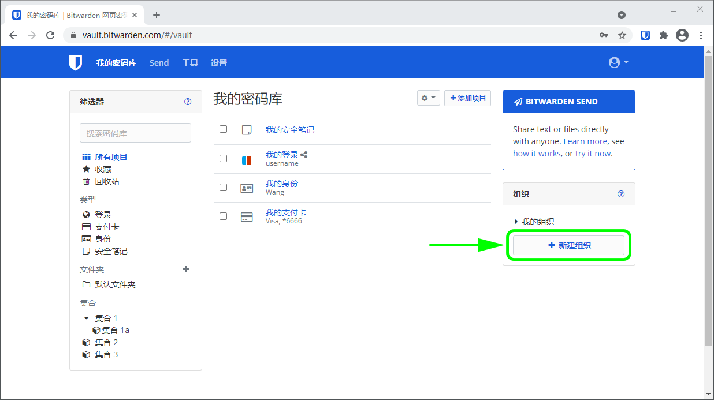

# 组织


对应的[官方文档地址](https://bitwarden.com/help/article/about-organizations/)


## 什么是组织？ 

组织将 Bitwarden 用户和密码库项目联系在一起，以[安全地共享](sharing.md)登录、笔记、支付卡和身份信息。组织有一个独立的密码库，[管理员](user-types-and-access-control.md)可以在其中管理组织的项目、用户和设置：


组织密码库


组织的成员可以在他们的**我的密码库**视图中找到已共享的项目，其与个人项目列在一起，以及已分配的集合筛选器，[集合](collections.md)用于分组组织项目，类似于[文件夹](../your-vault/folders.md)用于组织个人项目：


访问已共享的项目


### 组织的类型 

Bitwarden 提供了多种类型的组织，以满足您的企业或家庭的需求。关于每种组织类型的逐一功能细分，请参阅[关于 Bitwarden 计划](../plans-and-pricing/about-bitwarden-plans.md)。

| 类型   | 描述                                                                                                                                                                        |
| ---- | ------------------------------------------------------------------------------------------------------------------------------------------------------------------------- |
| 免费组织 | 免费组织允许 2 个用户在最多 2 个[集合](collections.md)中安全地共享。                                                                                                                            |
| 家庭住址 | 家庭组织允许 6 个用户在无限的[集合](collections.md)中安全地共享。                                                                                                                               |
| 团队组织 | 团队组织允许无限的用户（按每用户每月计费）在无限的[集合](collections.md)中安全地共享，并提供一套操作工具，如事件日志。                                                                                                      |
| 企业组织 | 企业组织允许无限的用户（按每用户每月计费）在无限的[集合](collections.md)中安全地共享，并在 Bitwarden 的操作工具套件中添加了仅针对企业的功能，例如 [SSO 登录](../login-with-sso/about-login-with-sso.md)和[策略](enterprise-policies.md)。 |

### 组织与高级会员比较 

关键的是要知道，**组织可以实现从组织到用户的安全共享**。[高级个人计划](../plans-and-pricing/about-bitwarden-plans.md#premium-individual)可解锁高级密码安全和管理功能，包括高级 2FA 选项、Bitwarden 验证器（TOTP）、加密的文件附件等，但高级个人计划**不包含安全数据共享功能**。

付费组织（家庭、团队或企业）自动为组织中已注册的**每一个**用户提供这些高级功能（高级 2FA 选项、Bitwarden 验证器（TOTP）等）。

### 组织与提供商比较 

[提供商](../provider-portal/provider-portal-overview.md)是密码库管理的实体，允许像托管服务提供商 （MSP）等企业代表商业客户快速创建和管理**多个 Bitwarden 组织**。

## 创建组织 

通过[网页密码库](../getting-started/getting-started-webvault.md)创建和管理组织。如果您是 Bitwarden 新手，请在开始一个组织之前[创建一个帐户](https://vault.bitwarden.com/#/register)，然后按照以下说明进行操作：

1、从您的网页密码库中选择**新建组织**按钮：

输入**组织名称**和一个我们可以联系到您的**账单电子邮件**。

2、选中**此帐户由公司拥有**复选框，将过滤为适合企业的选项，并提示您输入**企业名称**，以便我们知道该感谢谁！

3、**选择您的计划**。Bitwarden 提供适合任何需求的组织。查看[功能区别](../plans-and-pricing/about-bitwarden-plans.md#ji-hua-bi-jiao)，以找出最适合您的组织。


所有付费组织（家庭、团队或企业）都包含了所有注册用户的高级功能！


4、如果您选择**免费组织**，那么一切就准备好了！如果您选择我们的付费组织之一，

* **家庭/团队/企业**：您的计划随附了 1GB 加密[附件存储](../your-vault/file-attachments.md)空间。$0.33/月/GB 添**加附加存储（GB）**。
* **团队/企业**：指定组织所需的**用户席位**数量。以后可以随时添加更多席位。如果超过此数量，席位会自动增加，除非您[指定限制](user-management.md#set-a-seat-limit)。
* **团队/企业**：选择您要**按年**还是**按月**付费。家庭组织只能**按年**付费。

5、对组织满意后，请输入您的**付款信息**，然后选择**提交**。


新的家庭、团队和企业组织内置了 7 天免费试用！在您的试用期结束之前，我们不会向您收费，您可以随时从组织的**设置**选项卡中取消订阅。


创建您的组织后，就可以创建[集合](collections.md)、[邀请用户](user-management.md)并[开始共享](sharing.md)。
