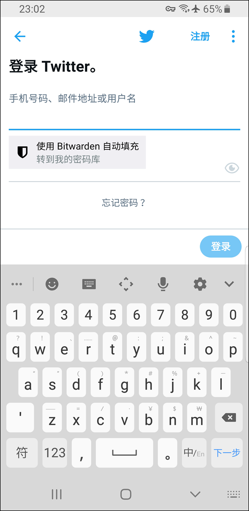

# Android 上的自动填充登录


对应的[官方文档地址](https://bitwarden.com/help/article/auto-fill-android/)


Bitwarden 可以自动填充您的密码，以便您可以无缝登录网站和应用程序，同时维护强大而安全的密码。自动填充通过检测与您登录的服务相匹配的密码库项目，以减少您在登录过程中的复制和粘贴操作。

如果您使用[帐户切换](../../../your-vault/account-switching.md)，将使用最后一个活动帐户的项目来自动填充。


_大多数_自动填充方案都依赖登录项目的 URI 属性。如果您不熟悉 URI，请阅读 [URI 的使用](../../../auto-fill/using-uris.md)一文。

请注意，移动端的自动填充当前不支持自定义字段。


## 账户切换时的自动填充 

如果您使用[帐户切换](../../../your-vault/account-switching.md)，您的移动应用程序将默认尝试从当前的活动帐户来自动填充凭据。在 Android 上，您可以在自动填充期间通过点击头像气泡从一个帐户切换到另一个帐户：


Android 账户切换


## 设置自动填充 

根据你设备上所运行的 Android 版本， 有几种不同的方式启用 Bitwarden 上的自动填充：

| 选项        | 要求的版本...      | 要求先启用...                              |
| --------- | ------------- | ------------------------------------- |
| 自动填充服务    | Android 8+    | -                                     |
| 内嵌自动填充    | Android 11+   | 自动填充服务，支持内嵌的 IME（Input Method Editor） |
| Draw-Over | Android 6+    | 无障碍                                   |
| 无障碍       | 所有 Android 版本 | -                                     |

### 自动填充服务 

当聚焦在设备上具有[匹配的登录项目](../../../auto-fill/using-uris.md)的输入字段时，自动填充服务（_要求 Android 8+_）将叠加一个弹出窗口。密码库被解锁后，系统会为您提供立即自动填充或打开密码库的选项：

要启用自动填充服务：

1. 打开 Bitwarden Android 应用程序并点击 **⚙️设置**标签。
2. 点击**自动填充服务**选项。
3. 切换**自动填充服务**选项。您将被自动重定向到 Android 设置界面。
4. 从自动填充服务列表中，点击 **Bitwarden**。

将提示您确认信任 Bitwarden。点击**确定**将使 Bitwarden 可以阅读屏幕上的内容，以了解何时提供自动填充。从[我们的这篇博客文章](https://bitwarden.com/blog/post/the-oreo-autofill-framework)中了解更多信息。

**自动填充服务不起作用？**参阅[自动填充服务疑难解答](../../../auto-fill/troubleshooting-android-auto-fill.md#troubleshooting-the-autofill-service)。

### 内嵌自动填充 


需先启用**自动填充服务**，才能启用内嵌自动填充。


内嵌自动填充（_要求 Android 11+、兼容的 IME（Input Method Editor）并且已启用**自动填充服务**_）将自动填充服务叠加层移动至键盘中：


GBoard 上的内嵌自动填充


要启用内嵌自动填充：

1. 打开 Bitwarden Android 应用程序并点击 **⚙️设置**标签。
2. 点击**自动填充服务**选项。
3. 切换**使用内嵌自动填充**选项。

如果您的自动填充叠加层没有移至键盘中，请检查您使用的 IME 是否支持内嵌。

### 无障碍 

当聚焦在设备上的输入字段时，无障碍方式将叠加一个弹出窗口，用于打开您的密码库来浏览[匹配的登录项目](../../../auto-fill/using-uris.md)：

要启用无障碍方式：

1. 打开 Bitwarden Android 应用程序并点击 **⚙️设置**标签。
2. 点击**自动填充服务**选项。
3. 切换**使用无障碍**选项。您将被自动重定向到 Android 设置界面。
4. 在服务或已下载应用程序列表中，点击 **Bitwarden** 并切换**使用 Bitwarden** 关 → 开。

将提示您接受允许设备上的 Bitwarden 权限。点击**允许**将使 Bitwarden 可以阅读屏幕上的内容，以了解何时提供自动填充。


如果您使用 Android 6+，您也可以启用 **Draw-Over**。

**无障碍不起作用？**参阅[无障碍服务疑难解答](../../../auto-fill/troubleshooting-android-auto-fill.md#troubleshooting-the-accessibility-service)。


### Draw-Over 


需先启用**无障碍**，才能启用 Draw-Over。


当聚焦在设备上的输入字段时，Draw-Over（_要求在 Android 6+ 上使用无障碍_）将叠加一个弹出窗口，用于打开您的密码库来浏览[匹配的登录项目](../../../auto-fill/using-uris.md)：

要启用 Draw-Over 方式：

1. 打开 Bitwarden Android 应用程序并点击 **⚙️设置**标签。
2. 点击**自动填充服务**选项。
3. 切换**使用 Draw-Over** 选项。您将被自动重定向到 Android 设置界面。
4. 从列表中点击 **Bitwarden** 并切换**允许在其他应用程序上绘制**选项。


**仍然有问题？**请参阅我们的 [Android 自动填充疑难解答](../../../auto-fill/troubleshooting-android-auto-fill.md)突破指南。

如果您仍然无法使用 Android 自动填充功能，请[联系我们](https://bitwarden.com/contact)。

