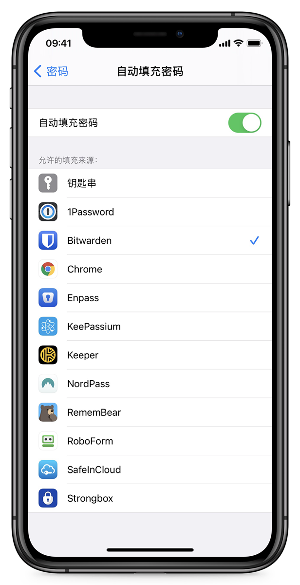
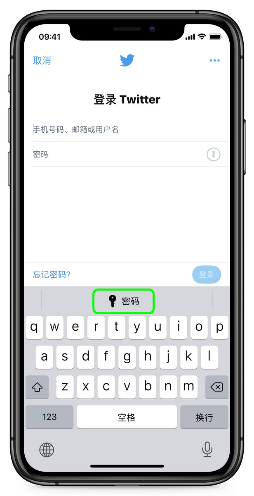
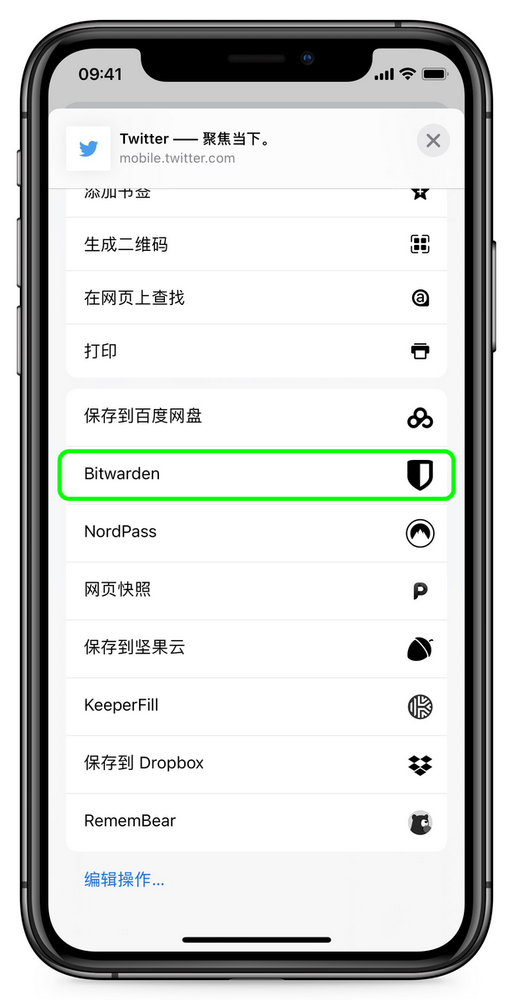

# iOS 上的自动填充登录


对应的[官方文档地址](https://bitwarden.com/help/article/auto-fill-ios/)


Bitwarden 可以自动填充您的密码，以便您可以无缝登录网站和应用程序，同时维护强大而安全的密码。自动填充通过检测与您登录的服务相匹配的密码库项目，以减少您在登录过程中的复制和粘贴操作。


_大多数_自动填充方案都依赖登录项目的 URI 属性。如果您不熟悉 URI，请阅读 [URI 的使用](../../../auto-fill/using-uris.md)一文。

请注意，移动端的自动填充当前不支持自定义字段。


## 在自动填充期间切换账户 

如果您登录了多个账户，您的移动应用程序将默认尝试从当前活动账户中自动填充凭据。您可以在自动填充期间通过点击头像气泡从一个账户切换到另一个账户：


iOS 账号切换


## 设置自动填充 

iOS 上的自动填充有两种：

* **键盘自动填充**：（推荐）使用此选项可以在任何 iOS 应用程序（包括网页浏览器）中通过一个键盘按钮来使用 Bitwarden 自动填充。
* **浏览器应用程序扩展自动填充**：使用此选项仅可以在网页浏览器应用程序（例如 Safari）中通过分享按钮来使用 Bitwarden 自动填充。


如果设备的[密码库超时行为](../../../your-vault/vault-timeout-options.md#vault-timeout-action)设置为**注销**，并且您仅启用了需要 NFC（例如带 NFC 的 YubiKey）的[两步登录方式](../../../two-step-login/two-step-login-methods.md)，则当前无法在 iOS 上使用自动填充，因为 iOS 不允许 NFC 输入中断自动填充工作流。

要么将您的密码库超时行为改为**锁定**，要么启用另一种两步登录方式。


### 键盘自动填充 

要启用 iOS 上的键盘自动填充：

1、打开设备上的 iOS **⚙️设置**应用程序。

2、点击**密码**。&#x20;

3、点击**自动填充密码**。

4、打开自动填充密码开关，并从**允许的填充来源**列表中选中 **Bitwarden**：


我们强烈建议在继续操作之前，在允许的填充来源列表中禁用任何其他自动填充服务（例如钥匙串）。


**让我们测试一下自动填充以确保其可以正常工作：**

5、打开一个您当前未登录的应用程序或网站。

6、在登录界面点击用户名或密码字段。键盘将上滑出一个匹配的登录 (`my_username`) 或 **🔑密码**按钮：

如果显示一个[匹配的登录](../../../auto-fill/using-uris.md)，请点击以自动填充。如果显示 **🔑密码**按钮，请点击它浏览您的密码库以搜索要使用的登录项目。如果显示 **🔑密码**按钮，可能是因为您的密码库中没有具有匹配 URI 的项目。


遇到 `Biometric unlock disabled pending verification of master password（生物识别解锁已禁用，等待验证主密码）` 信息？了解[该怎么做](../../../auto-fill/auto-fill-faqs.md#q-what-do-i-do-about-biometric-unlock-disabled-pending-verification-of-master-password)。


### 浏览器应用程序扩展自动填充 

要启用 iOS 上的浏览器应用程序扩展自动填充：

1、打开 Bitwarden iOS 应用程序并点击 **⚙️设置**。

2、在自动填充部分点击**应用程序扩展**选项。&#x20;

3、点击**启用应用程序扩展**按钮。&#x20;

4、从上滑出的分享菜单中，点击 **Bitwarden**。&#x20;

绿色的`扩展已激活！`消息指示已成功激活此选项。

**让我们测试一下应用程序扩展以确保其可以正常工作：**

5、打开您设备的网页浏览器并导航一个您当前未登录的网站。

6、点击**分享**图标。

7、向下滚动并点击 **Bitwarden** 选项：


如果启用了[使用生物识别解锁](../../../your-vault/unlocking-with-biometrics.md)，则首次点击此选项时，系统将提示您验证您的主密码。


8、Bitwarden 界面将在您的设备上向上滑出，并列出此网站的[匹配登录项目](../../../auto-fill/using-uris.md)。点击该项目以自动填充。


如果未列出登录项目，则可能是因为您的密码库中没有与 [URI 匹配](../../../auto-fill/using-uris.md)的项目。

