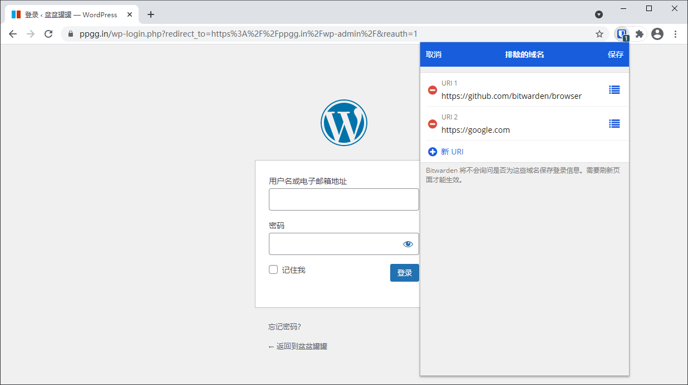

# 排除域名


对应的[官方文档地址](https://bitwarden.com/help/article/exclude-domains/)


Bitwarden 浏览器扩展可以配置排除特定域名（即明确不为其提示保存密码）。当某个域名位于**排除域名**列表中时，Bitwarden 不会弹出提示记住输入的密码：


浏览器扩展弹出提示


要配置排除域名，请打开 **⚙️设置**选项卡，然后选择**排除域名**选项：

_域名排除不会注册「完整」的 URL，只会注册域名组件_。在上面的例子中，`https://github.com/bitwarden/browser` 在保存时将解析为 `github.com`，这意味着浏览器扩展将明确不为 Github 弹出提示保存凭证。
