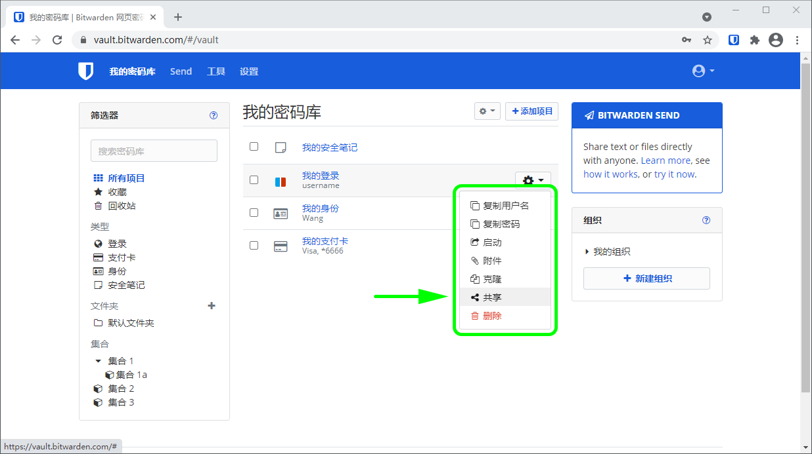
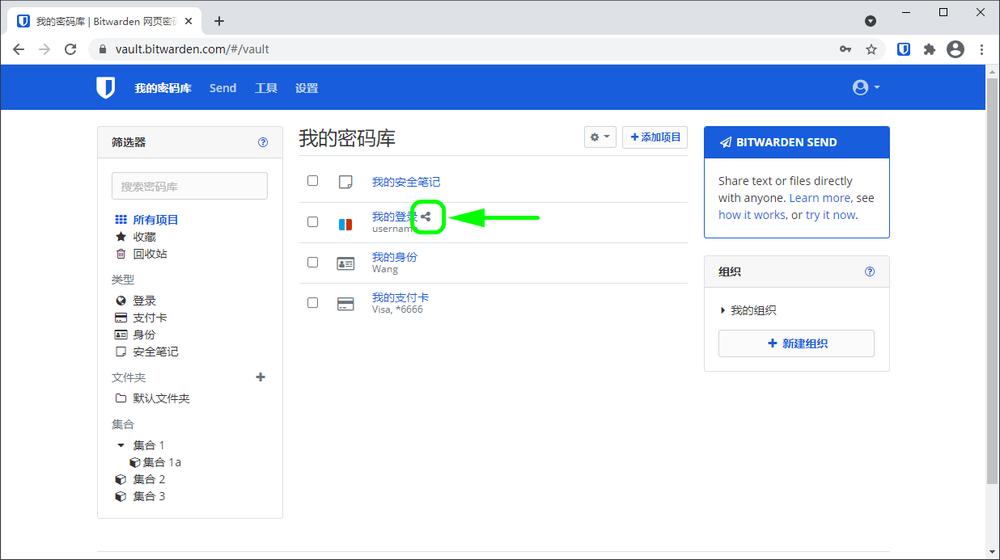

# 共享


对应的[官方文档地址](https://bitwarden.com/help/article/share-to-a-collection/)



要共享项目，你需要是组织的成员。了解更多关于[组织](../../admin-console/organization-basics/organizations.md)或了解如何[创建自己的两个人的组织](../../admin-console/getting-started-organizations.md)。


共享 Bitwarden 项目意味着将它们放入一个集合中，集合是用于将共享的项目、笔记、支付卡和身份集中到一起，以供多个用户访问的一种结构。您可以通过几种不同的方式将项目共享到集合：

## 移动项目到组织 

组织成员可以将项目共享给任何已分配的集合，除非他们被赋予了此集合的[**只读**访问](../../admin-console/user-management/user-types-and-access-control.md)权限。只能**从网页密码库**共享项目。要共享现有项目：

1、悬停在您要共享的项目上并选择 **⚙️**齿轮下拉菜单。

2、从下拉菜单中选择 **→移动到组织**选项。

3、在**移动到组织**界面：

* 选择您要与之共享此项目的**组织**。
* 选中一个或多个**集合**，以将此项目共享到其中。您必须_至少_选择一个集合。

4、点击**保存**以完成此项目的共享。

共享一个项目**将把所有权转移给这个组织**。这意味着任何有权限的人都可以更改或删除该项目，这也将从您的密码库中移除该项目。当一个项目的名称旁边有**已共享**图标时，您可以判断该项目是共享的：

## 创建组织项目 

组织成员可以直接为任何已分配的集合创建新的项目，除非他们被赋予了此集合的[**只读**访问](../../admin-console/user-management/user-types-and-access-control.md)权限。只能**从网页密码库**创建共享项目，可以从你的个人密码库或从组织视图创建共享项目：



要创建一个新的共享项目：

1. 在 **🔒我的密码库**页面，选择 **🞤添加项目**按钮。
2. 填写此共享项目的所有相关信息。
3. 在添加项目面板底部的**所有权**部分中，选择要与其共享此项目的组织。
4. 选中一个或多个**集合**，以将此项目共享到其中。您必须_至少_选择一个集合。
5. 点击**保存**以完成共享项目的创建。

创建一个共享项目**将把所有权设置为这个组织**。这意味着任何有权限的人都可以更改或删除该项目，这也将从您的密码库中移除该项目。当一个项目的名称旁边有**共享**图标时，您可以判断该项目是共享的：




要创建一个新的共享项目：

1. 在你的组织的 **🔒密码库**选项卡，选择 **🞤添加项目**按钮。
2. 填写此共享项目的所有相关信息。
3. 使用此方式时，项目的所有权会自动设置为组织，因此您所要做的就是选中一个或多个**集合**，以将此项目共享到其中。您必须至少选择一个集合。
4. 点击**保存**以完成共享项目的创建。

创建一个共享项目或共享一个项目**将把所有权设置为这个组织**。这意味着任何有权限的人都可以更改或删除该项目，这也将从您的密码库中移除该项目。当一个项目的名称旁边有**共享**图标时，您可以判断该项目是共享的：



