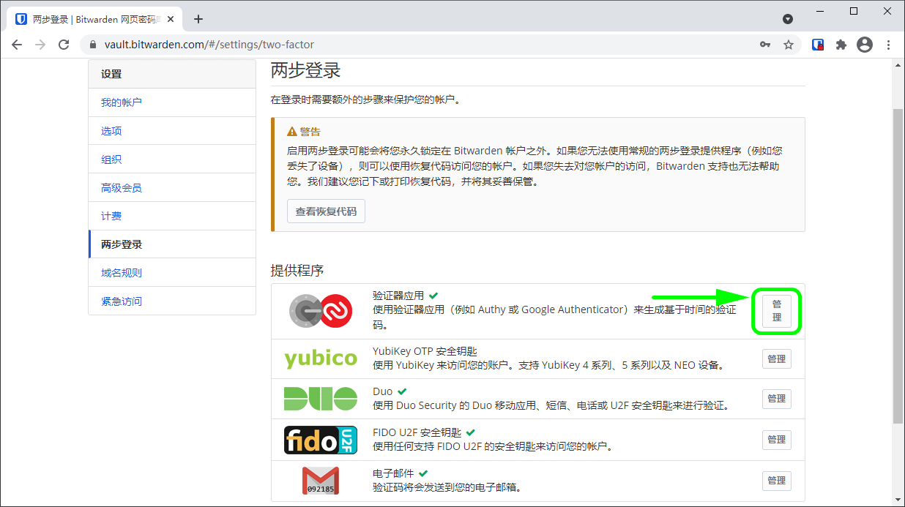

# 两步登录-验证器


对应的[官方文档地址](https://bitwarden.com/help/article/setup-two-step-login-authenticator/)


第三方验证器应用程序（例如 [Authy](https://authy.com/)，[Google Authenticator](https://support.google.com/accounts/answer/1066447?hl=en) 或 [FreeOTP](https://freeotp.github.io/)）方式的两步登录对于所有 Bitwarden 用户是免费的。


某些身份验证器应用程序（例如 Google 身份验证器）不会自动备份您的 2FA 令牌以方便迁移到新的移动设备。在这些情况下，您应该手动保存每个令牌的身份验证器恢复代码。

其他应用程序如 Authy 等，支持跨设备备份和同步。在这些情况下，请务必设置一个强大的备份密码并将其记录在您的 Bitwarden 密码库中。


## 设置验证器 

完成以下步骤以启用验证器应用程序方式的两步登录：


**丢失对验证器应用程序的访问会永久性将您锁定在您的密码库之外**，除非您将您的两步登录恢复代码写下并将其保存在安全的地方，或拥有已启用并可用的备用两步登录方式。

启用任何方式之后，应立即通过**两步登录**界面[获取您的恢复代码](../recovery-codes.md)。


1、登录您的[网页密码库](https://vault.bitwarden.com/)。

2、从顶部导航栏选择**设置**。

3、从左侧菜单选择**两步登录**。

4、定位到**验证器应用**选项并选择**管理**按钮：

将提示您输入您的主密码以继续。

5、使用您的验证器应用程序扫描 QR 码。

如果您的移动设备上还未安装验证器应用程序，下载一个并扫描 QR 码。我们建议使用 [Authy](https://authy.com/)。

6、扫描后，您的验证器应用程序将返回一个 6 位数的验证码。将此代码输入您的网页密码库对话框并单击**启用**按钮。

一个绿色的`已启用`信息表明验证器应用的两步登录已被启用。

7、单击**关闭**按钮，并确认**验证器应用**选项现在已被启用（通过一个绿色勾号 **✔️** 指示）。


我们建议在继续测试两步登录之前保持活动的网页密码库选项卡为打开状态，以防出现配置错误的情况。当您确认它正常工作后，你应该注销所有的 Bitwarden 应用程序，以为每个应用程序立即激活两步登录。您最终会被自动注销。


## 使用验证器 

以下内容假设**验证器**是您[已启用的最高优先级方式](../two-step-login-methods.md#using-multiple-methods)。完成以下步骤，以使用两步登录访问您的密码库：

1、在任一个 Bitwarden 应用程序上输入您的电子邮件地址和主密码以登录密码库。\
将提示您**输入来自您的验证器应用程序的 6 位验证码**。

2、打开您的验证器应用程序并找到用于您的 Bitwarden 密码库的 6 位验证码。在密码库登录界面输入此代码。通常，验证码每 30 秒会更新一次。


勾选**记住我**方框，以记住您的设备，为期30天。记住你的设备意味着你不会被要求完成两步登陆步骤。


3、选择**继续**以完成登录。

登录后，您将不会被要求完成第二步的两步登录步骤就可以**解锁**您的密码库。有关配置注销和锁定行为的帮助，请参阅[密码库超时选项](../../your-vault/vault-timeout-options.md)。
