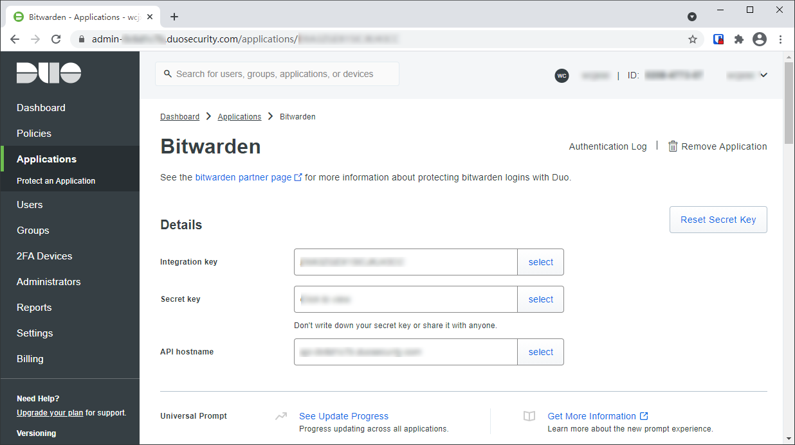
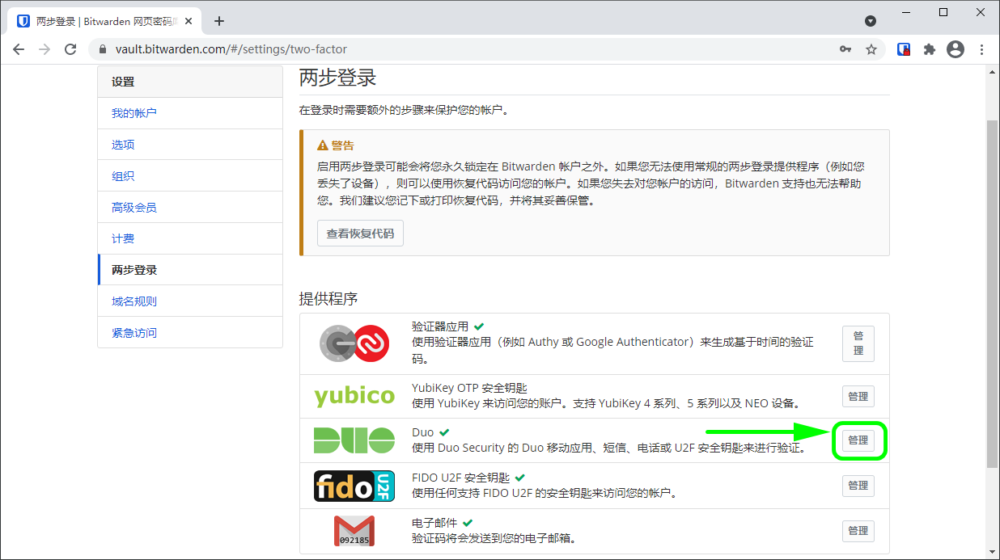
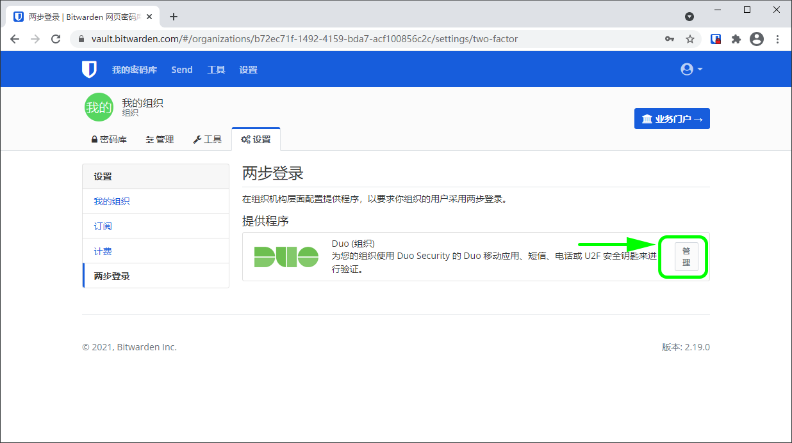
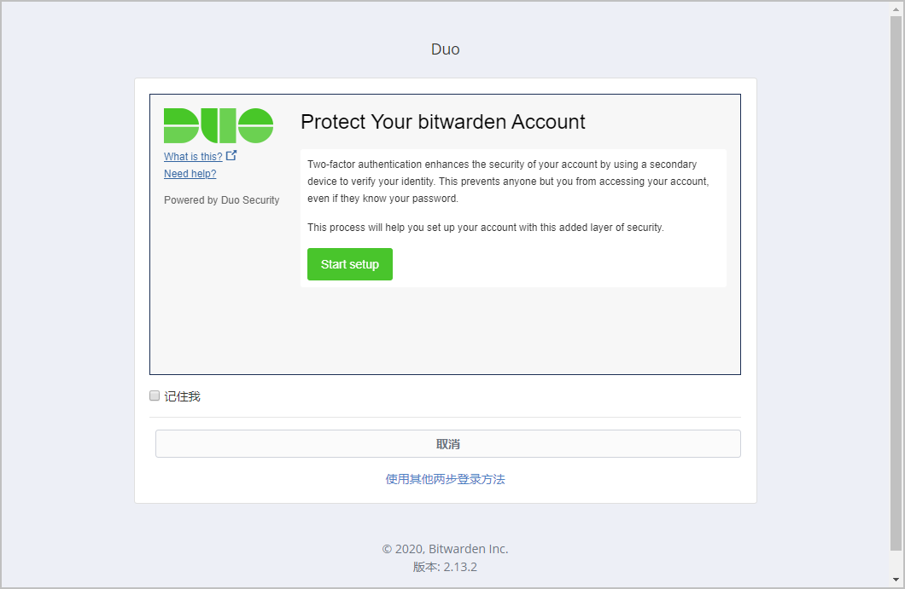

# 两步登录-Duo


对应的[官方文档地址](https://bitwarden.com/help/article/setup-two-step-login-duo/)


在 Bitwarden 现有的两步登录方式中，使用 Duo 的两步登录是比较独特的，因为它可以为个人密码库启用（与其他方式一样），对[团队和企业](../../organizations/organizations.md)组织来说，**可以为整个组织启用**。

为一个组织启用 Duo 后，将提示所有已注册成员在他们下次登录时注册一个设备以用于 Duo 方式的两步登录。

在管理面板中[配置 Duo](two-step-login-via-duo.md#configure-duo) 和[注册设备](two-step-login-via-duo.md#register-a-device)在任何一种情况下都将遵循相同的过程，但最初的[设置过程](two-step-login-via-duo.md#setup-duo)略有不同，这取决于您是为您自己设置 Duo 还是为组织设置 Duo。

## 配置 Duo 

您需要一个 Duo 帐户才能获取 Bitwarden 所需的一些信息以完成设置。[免费注册](https://signup.duo.com/)，或登录到现有的 [Duo Admin Panel](https://admin.duosecurity.com/login)。要配置 Duo：

1. 在左侧菜单中，导航至 **Applications**。
2. 选择 **Protect an Application** 按钮。
3. 在应用程序列表中查找或检索 **Bitwarden**，然后选择 **Protect** 按钮。您将被重定向到一个 Bitwarden 应用程序页面：

记录下 **Integration key**、**Secret key** 和 **API hostname**。当您在 Bitwarden 中[设置 Duo](two-step-login-via-duo.md#setup-duo) 时，需要参考这些值。

## 设置 Duo 

在 Bitwarden 中设置 Duo 的方法略有不同，这取决于您是为您的个人密码库还是为您的组织启用。选择下面的选项卡获取相应的介绍：




**丢失对启用了 Duo 的设备的访问会永久性将您锁定在您的密码库之外**，除非您将您的两步登录恢复代码写下并将其保存在安全的地方，或拥有已启用并可用的备用两步登录方式。

完成如下步骤之后，应立即通过**两步登录**界面[获取您的恢复代码](../recovery-codes.md)。


要为你的个人密码库启用 Duo 方式的两步登录：

1、登录您的[网页密码库](https://vault.bitwarden.com/)。

2、从顶部导航栏选择**设置**。


选择设置


3、从左侧工具菜单选择**两步登录**。

4、定位到 **Duo** 选项并选择**管理**按钮。

将提示您输入主密码以继续。

5、输入[从您的 Duo Admin Portal 中获得](two-step-login-via-duo.md#configure-duo)的 **Integration Key**、**Secret Key** 和 **API Hostname**。

6、选择**启用**按钮。

一个绿色的`已启用`消息，表明已为您的密码库成功启用了 Duo。通过选择**关闭**按钮并看到 **Duo** 选项上有一个绿色的复选标记（**✔️**）以再次检查。


我们建议在继续测试两步登录之前保持活动的网页密码库选项卡为打开状态，以防出现配置错误的情况。当您确认它正常工作后，你应该注销所有的 Bitwarden 应用程序，以为每个应用程序立即激活两步登录。您最终会被自动注销。





**仅适用于组织**：一旦您初次[配置](two-step-login-via-duo.md#configure-duo)和[设置](two-step-login-via-duo.md#setup-duo)了 Duo，在通过 Duo Admin Panel 进行任何进一步的应用配置更改之前，必须先禁用该组织的 Duo，这一点**非常重要**。要进行配置更改，请在 Bitwarden 中禁用 Duo，在 Duo Admin Panel 中进行必要的更改，然后在 Bitwarden 中重新启用 Duo。

这是因为用于组织的 Duo 目前不支持[恢复代码](../recovery-codes.md)，您需要依靠 Duo Admin Panel 为失去 Duo 访问权限的成员绕过两步登录。当 Duo 处于活动状态时，在 Duo 管理面板上更改应用程序配置，可能会使您或您组织的成员失去绕过两步登录的能力。


您必须是组织的[所有者](../../admin-console/user-management/member-roles-and-permissions.md)才能为您的组织设置 Duo。要为你的组织启用 Duo 方式的两步登录：

1、登录您的[网页密码库](https://vault.bitwarden.com/)。

2、打开您的组织并从组织导航选择**设置**。


选择设置


3、从左侧工具菜单选择**两步登录**。

4、定位到 **Duo（组织）** 选项并选择**管理**按钮。

将提示您输入主密码以继续。

5、输入[从您的 Duo Admin Portal 中获得](two-step-login-via-duo.md#configure-duo)的 **Integration Key**、**Secret Key** 和 **API Hostname**。

6、选择**启用**按钮。

一个绿色的`已启用`消息表明已为您的密码库成功启用了 Duo。通过选择**关闭**按钮并看到 **Duo** 选项上有一个绿色的复选标记（**✔️**）以再次检查。



### 注册设备 

[设置 Duo](two-step-login-via-duo.md#setup-duo) 后，在一个新的选项卡中导航到[网页密码库](https://vault.bitwarden.com/)。如果 Duo 是您最优先的两步登录方式，Duo 设置界面上将提示您。

按照屏幕上的提示将辅助设备配置为使用 Duo（例如，_注册_和_发送 SMS_ 或_发送推送通知的设备类型_）。如果您尚未下载 Duo 移动应用程序，建议您下载：

* [下载 iOS 版](https://itunes.apple.com/us/app/duo-mobile/id422663827?mt=8)
* [下载 Android 版](https://play.google.com/store/apps/details?id=com.duosecurity.duomobile)

## 使用 Duo 

以下内容假设 **Duo** 是您[已启用的最高优先级方式](../two-step-login-methods.md#using-multiple-methods)。完成以下步骤，以使用两步登录访问您的密码库：

1. 在任一个 Bitwarden 应用程序上输入您的电子邮件地址和主密码以登录密码库。\
   将显示一个 Duo 界面以开始您的两步登录验证。&#x20;
2. 根据您的 Duo 的配置方式，通过以下方式完成验证请求：
   * 从您已注册的设备上批准 **Duo Push** 请求。
   * 在您的 **Duo 移动应用**或**短信**中找到 6 位验证码，并在密码库登录界面输入此验证码。


勾选**记住我**方框，以记住您的设备，为期30天。记住你的设备意味着你不会被要求完成两步登陆步骤。


登录后，您将不会被要求完成第二步的两步登录步骤就可以**解锁**您的密码库。有关配置注销和锁定行为的帮助，请参阅[密码库超时选项](../../your-vault/vault-timeout-options.md)。
