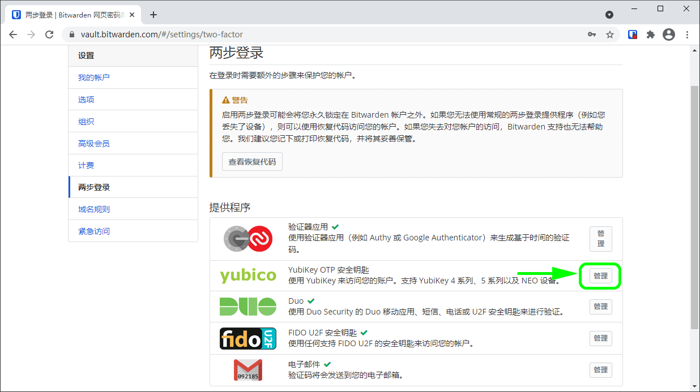
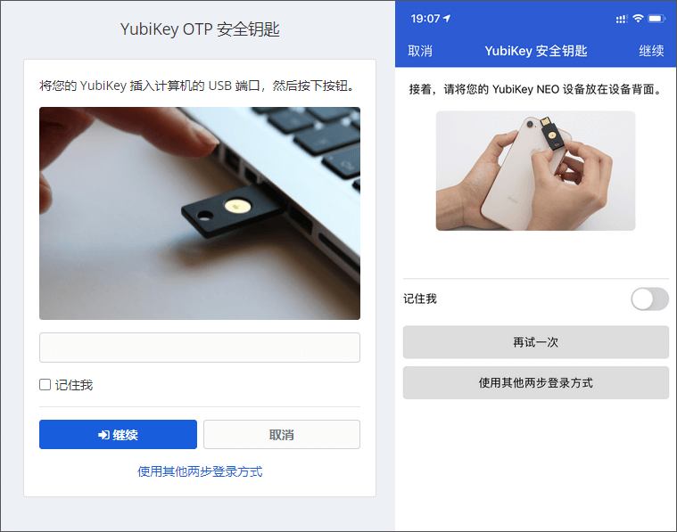

# 两步登录-YubiKey


对应的[官方文档地址](https://bitwarden.com/help/article/setup-two-step-login-yubikey/)


[YubiKey](https://www.yubico.com/) 方式的两步登录适用于高级用户，包括付费组织（家庭、团队或企业）的成员。

可以使用任何[支持 OTP 功能的 YubiKey](https://www.yubico.com/products/yubikey-hardware/compare-yubikeys/) ，包括所有 YubiKey 4 和 5 系列设备以及 YubiKey NEO 和 YubiKey NFC。最多可以添加 5 个 YubiKey 到您的账户中。


大多数现代 YubiKeys，包括 5 系列钥匙，都支持 FIDO2 WebAuthn 协议。如果您的密钥支持它，我们建议按照[这些说明](two-step-login-via-fido2-webauthn.md)将您的密钥设置为 FIDO2 WebAuthn 设备。您可以使用 [YubiKey Manager](https://www.yubico.com/support/download/yubikey-manager/) 应用程序来检测是否支持 FIDO2 WebAuthn。


## 设置 YubiKey 

要启用 YubiKey 方式的两步登录：


**丢失对您的 YubiKey 的访问会永久性将您锁定在您的帐户之外**。除非您将您的两步登录恢复代码写下并将其保存在安全的地方，或拥有已启用并可用的备用两步登录方式。

启用任何方式之后，应立即通过**两步登录**界面[获取您的恢复代码](../recovery-codes.md)。


1、登录您的[网页密码库](https://vault.bitwarden.com/)。

2、从顶部导航栏选择**设置**。

3、从左侧菜单选择**两步登录**。

4、定位到 **YubiKey 安全钥匙**选项并选择**管理**按钮：

将提示您输入主密码以继续。

5、将 YubiKey 插入计算机的 USB 端口。

6、在您的网页密码库对话框中选择第一个空白的 Yubikey 输入字段。

7、触摸 YubiKey 上的按钮。

如果您要在支持 NFC 的移动设备上使用 Yubikey，请勾选**我的钥匙之一支持 NFC** 复选框。

8、选择**保存**按钮。绿色的`已启用`消息表明已成功启用 FIDO U2F 的两步登录。

9、选择**关闭**按钮，并确认 **YubiKey OPT 安全钥匙**选项现在已启用（通过一个绿色的勾号 **✔️** 指示）。

重复此过程以向您的帐户中添加最多 5 个 YubiKey。


我们建议在继续测试两步登录之前保持活动的网页密码库选项卡为打开状态，以防出现配置错误的情况。当您确认它正常工作后，你应该注销所有的 Bitwarden 应用程序，以为每个应用程序立即激活两步登录。您最终会被自动注销。


## 使用 YubiKey 

以下内容假设 **YubiKey** 是您[已启用的最高优先级方式](../two-step-login-methods.md#using-multiple-methods)。完成以下步骤，以使用两步登录访问您的密码库：

1、在任一个 Bitwarden 应用程序中输入您的电子邮件地址和主密码登录密码库。

系统将提示您将 YubiKey 插入计算机的 USB 端口，或将 YubiKey 靠近支持 NFC 的设备背面：


勾选**记住我**方框，以记住您的设备，为期30天。记住你的设备意味着你不会被要求完成两步登陆步骤。


**如果您在移动设备上使用的是非 NFC 的 YubiKey：**

1. 将 YubiKey 插入设备。
2. 点击**取消**以结束 NFC 提示。
3. 点击用灰色下划线表示的文本输入字段
4. 点击或按下您 YubiKey 上的按钮以插入代码

2、点击或选择**继续**以完成登录。

登录后，您将不会被要求完成第二步的两步登录步骤就可以**解锁**您的密码库。有关配置注销和锁定行为的帮助，请参阅[密码库超时选项](../../your-vault/vault-timeout-options.md)。

## NFC 故障排除 

如果您的 YubiKey 的 NFC 功能无法正常使用：

**检查 NFC 是否已启用：**

1. 下载 [YubiKey Manager](https://www.yubico.com/products/services-software/download/yubikey-manager/)
2. 将 YubiKey 插入设备
3. 选择 **Interface** 选项卡，然后检查 NFC 部分中的所有复选框是否都已选中

**检查 NFC 的配置是否正确：**

1. 下载 [YubiKey Personalization Tool](https://www.yubico.com/products/services-software/download/yubikey-personalization-tools/)
2. 将 YubiKey 插入设备
3. 选择 **Tools** 选项卡
4. 选择 **NDEF Programming** 按钮
5. 选择您希望 YubiKey 在 NFC 上使用的配置插槽
6. 选择 **Program** 按钮。

（**仅 Android）检查如下项目：**

1. 在设置过程中勾选了**我的钥匙之一支持 NFC** 复选框。
2. 您的 Android 设备支持 [NFC](https://en.wikipedia.org/wiki/List\_of\_NFC-enabled\_mobile\_devices)，并且[很确定](https://forum.yubico.com/viewtopic1c5f.html?f=26\&t=1302)地可以与 YubiKey NEO 或 YubiKey 5 NFC 一起正常使用。
3. 您已在 Android 设备上启用了 NFC（**设置** → **更多**）。
4. 您的键盘布局/格式/模式已设置为 QWERTY。
