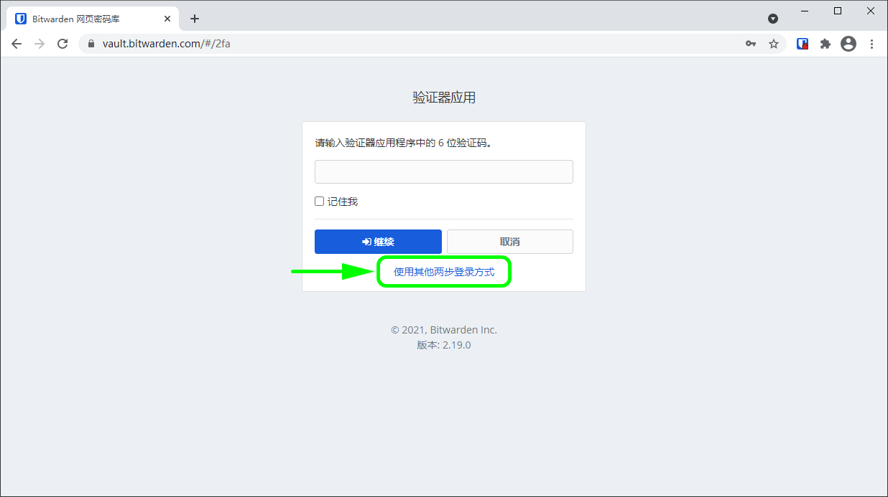

# 两步登录方式


对应的[官方文档地址](https://bitwarden.com/help/article/setup-two-step-login/)


使用两步登录（也称为_双因素验证_或 _2FA_）来保护您的 Bitwarden 密码库，通过在您登录时要求使用辅助设备进行验证，防止恶意参与者访问密码库项目（即使他们发现了您的主密码）。如果您不熟悉 2FA 的基础知识，请查看我们的[现场指南](field-guide-for-two-step-login.md)。

两步登录有许多不同的方式，从专用的验证器应用程序到硬件安全钥匙。无论你选择什么，Bitwarden 强烈建议你使用两步登录来保护你的密码库。事实上，我们认为这是非常重要的，所以我们很乐意为您[免费](two-step-login-methods.md#free-methods)提供一些方式。

## 用于个人的两步登录 

您可以通过[网页密码库](../getting-started/getting-started-webvault.md)的**设置**菜单逐个启用如下的两步登录方式。

### 免费方式 

Bitwarden 提供了几种两步登录方式免费使用，包括：

| 方式                                                                                                                           | 设置说明                                                    |
| ---------------------------------------------------------------------------------------------------------------------------- | ------------------------------------------------------- |
| 通过验证器应用程序（例如 [Authy](https://authy.com/) 或 [Google Authenticator](https://support.google.com/accounts/answer/1066447?hl=en)） | 点[这里](setup-guides/two-step-login-via-authenticator.md) |
| 通过电子邮件                                                                                                                       | 点[这里](setup-guides/two-step-login-via-email.md)         |

### 高级方式 

对于高级用户（包括付费组织的成员），Bitwarden 提供了几种高级的两步登录方式：

| 方式                                          | 设置说明                                                     |
| ------------------------------------------- | -------------------------------------------------------- |
| 通过具有 Duo Push、短信、电话和安全钥匙的 Duo Security      | 点[这里](setup-guides/two-step-login-via-duo.md)            |
| 通过 YubiKey（任何 4/5 系列或 YubiKey NEO/NFC 设备）   | 点[这里](setup-guides/two-step-login-via-yubikey.md)        |
| 通过 FIDO2 WebAuthn（任何 FIDO2 WebAuthn 认证的验证器） | 点[这里](setup-guides/two-step-login-via-fido2-webauthn.md) |

## 用于团队和企业的两步登录 

虽然上述所有用于个人的方式都可以启用，但团队和企业组织可以从**组织的设置**菜单启用以下**组织层面**的方式。

| 方式                                     | 设置说明                                          |
| -------------------------------------- | --------------------------------------------- |
| 通过具有 Duo Push、短信、电话和安全钥匙的 Duo Security | 点[这里](setup-guides/two-step-login-via-duo.md) |

## 使用多个方式 

您可以选择启用多个两步登录方式。当你使用多个已启用的方式登录到 Bitwarden 时，将按照以下优先顺序提示您使用最高优先级的两步登录方式：

1. Duo（组织）
2. FIDO2 WebAuthn
3. YubiKey
4. Duo（个人）
5. 验证器应用程序
6. 电子邮件


如果您使用 SSO 登录，则不建议使用电子邮件方式的两步登录，因为使用多个方法会导致错误。可以考虑改为设置[免费的验证器应用程序方式的两步登录](setup-guides/two-step-login-via-authenticator.md)。


不过，任何方式都可以使用。通过选择**使用其他两步登录方式**按钮，以使用低优先级方式进行验证：

